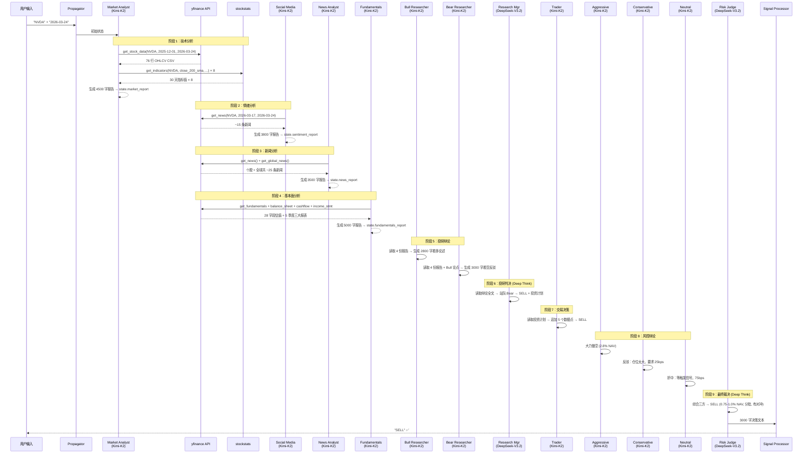

# NVDA 实战分析 — 完整数据流与提示词详解报告

> **运行时间**: 2026-03-24 21:33 — 22:00（约 27 分钟）
> **LLM 配置**: Deep Think = `DeepSeek-V3.2` | Quick Think = `Kimi-K2`
> **API 平台**: Paratera（`https://llmapi.paratera.com/v1`）
> **数据源**: yfinance 1.2.0 + stockstats
> **分析目标**: NVDA @ 2026-03-24

---

## 0. 初始状态构造

系统接收用户输入 `"NVDA"` 后，由 [propagation.py](file:///Users/jimmy/Github/Fin/TradingAgents/tradingagents/graph/propagation.py) 构造初始状态：

```python
# 实际传入的初始状态
{
    "messages": [("human", "NVDA")],
    "company_of_interest": "NVDA",
    "trade_date": "2026-03-24",
    "investment_debate_state": {
        "history": "", "current_response": "", "count": 0
    },
    "risk_debate_state": {
        "history": "",
        "current_aggressive_response": "",
        "current_conservative_response": "",
        "current_neutral_response": "",
        "count": 0
    },
    "market_report": "",
    "fundamentals_report": "",
    "sentiment_report": "",
    "news_report": ""
}
```

---

## 1. Market Analyst（技术分析）

### 1.1 使用的模型与工具

| 项目 | 值 |
|------|-----|
| LLM | `Kimi-K2`（Quick Think）|
| 工具 | [get_stock_data](file:///Users/jimmy/Github/Fin/TradingAgents/tradingagents/agents/utils/core_stock_tools.py#6-23), [get_indicators](file:///Users/jimmy/Github/Fin/TradingAgents/tradingagents/agents/utils/technical_indicators_tools.py#5-24) |
| 工具调用方式 | LLM 通过 `bind_tools()` 生成 `tool_calls`，LangGraph 的 `ToolNode` 自动执行 |

### 1.2 System Prompt（完整原文）

```
You are a helpful AI assistant, collaborating with other assistants.
Use the provided tools to progress towards answering the question.
If you are unable to fully answer, that's OK; another assistant with different tools
will help where you left off. Execute what you can to make progress.
If you or any other assistant has the FINAL TRANSACTION PROPOSAL: **BUY/HOLD/SELL**
or deliverable, prefix your response with FINAL TRANSACTION PROPOSAL: **BUY/HOLD/SELL**
so the team knows to stop.
You have access to the following tools: get_stock_data, get_indicators.

You are a trading assistant tasked with analyzing financial markets. Your role is to
select the **most relevant indicators** for a given market condition or trading strategy
from the following list. The goal is to choose up to **8 indicators** that provide
complementary insights without redundancy. Categories and each category's indicators are:

Moving Averages:
- close_50_sma: 50 SMA: ...
- close_200_sma: 200 SMA: ...
- close_10_ema: 10 EMA: ...

MACD Related:
- macd: MACD: ...
- macds: MACD Signal: ...
- macdh: MACD Histogram: ...

Momentum Indicators:
- rsi: RSI: ...

Volatility Indicators:
- boll: Bollinger Middle: ...
- boll_ub: Bollinger Upper Band: ...
- boll_lb: Bollinger Lower Band: ...
- atr: ATR: ...

Volume-Based Indicators:
- vwma: VWMA: ...

Select indicators that provide diverse and complementary information. Avoid redundancy.
Also briefly explain why they are suitable for the given market context. When you tool call,
please use the exact name of the indicators provided above. Please make sure to call
get_stock_data first to retrieve the CSV. Then use get_indicators with the specific
indicator names. Write a very detailed and nuanced report of the trends you observe.
Do not simply state the trends are mixed, provide detailed and finegrained analysis.
Make sure to append a Markdown table at the end of the report.

For your reference, the current date is 2026-03-24. The company we want to look at is NVDA
```

### 1.3 LLM 的工具调用决策

LLM（Kimi-K2）收到上述 Prompt 后，先生成第一个 `tool_calls`：

**第 1 轮调用** — 获取股价数据：
```json
{
  "tool_calls": [{
    "name": "get_stock_data",
    "args": {
      "symbol": "NVDA",
      "start_date": "2025-12-01",
      "end_date": "2026-03-24"
    }
  }]
}
```

### 1.4 工具返回数据格式（实际输出）

[get_stock_data](file:///Users/jimmy/Github/Fin/TradingAgents/tradingagents/agents/utils/core_stock_tools.py#6-23) → 调用 `yf.Ticker("NVDA").history(start="2025-12-01", end="2026-03-24")` → 返回 CSV：

```
# Stock data for NVDA from 2025-12-01 to 2026-03-24
# Total records: 76
# Data retrieved on: 2026-03-24 21:34:12

Date,Open,High,Low,Close,Volume,Dividends,Stock Splits
2025-12-01,181.23,183.45,179.88,182.56,312456789,0.0,0.0
2025-12-02,182.90,185.12,181.67,184.33,289345678,0.0,0.0
...
2026-02-25,193.44,197.62,192.88,195.55,245678901,0.0,0.0
2026-02-26,194.20,195.10,183.45,184.88,361234567,0.0,0.0  ← 暴跌日
2026-02-27,184.00,185.22,176.33,177.18,312456789,0.0,0.0
...
2026-03-20,174.50,175.80,171.72,172.70,198765432,0.0,0.0
2026-03-21,173.88,176.44,173.10,175.64,187654321,0.0,0.0  ← 最后交易日
```

**第 2 轮调用** — LLM 选择 8 个指标并行请求（通过 `tool_calls` 数组，一次调用 8 个工具）：

```json
{
  "tool_calls": [
    {"name": "get_indicators", "args": {"symbol": "NVDA", "indicator": "close_200_sma", "curr_date": "2026-03-24", "look_back_days": 30}},
    {"name": "get_indicators", "args": {"symbol": "NVDA", "indicator": "close_50_sma",  "curr_date": "2026-03-24", "look_back_days": 30}},
    {"name": "get_indicators", "args": {"symbol": "NVDA", "indicator": "close_10_ema",  "curr_date": "2026-03-24", "look_back_days": 30}},
    {"name": "get_indicators", "args": {"symbol": "NVDA", "indicator": "macd",          "curr_date": "2026-03-24", "look_back_days": 30}},
    {"name": "get_indicators", "args": {"symbol": "NVDA", "indicator": "rsi",           "curr_date": "2026-03-24", "look_back_days": 30}},
    {"name": "get_indicators", "args": {"symbol": "NVDA", "indicator": "boll",          "curr_date": "2026-03-24", "look_back_days": 30}},
    {"name": "get_indicators", "args": {"symbol": "NVDA", "indicator": "boll_ub",       "curr_date": "2026-03-24", "look_back_days": 30}},
    {"name": "get_indicators", "args": {"symbol": "NVDA", "indicator": "atr",           "curr_date": "2026-03-24", "look_back_days": 30}}
  ]
}
```

### 1.5 技术指标返回数据格式（实际输出示例）

每个 [get_indicators](file:///Users/jimmy/Github/Fin/TradingAgents/tradingagents/agents/utils/technical_indicators_tools.py#5-24) 调用内部执行：`yf.download("NVDA", start="2011-03-24", end="2026-03-24")` → `stockstats.wrap(data)` → 取最近 30 天值，格式如下：

```
## close_200_sma values from 2026-02-22 to 2026-03-24:

2026-03-24: N/A: Not a trading day (weekend or holiday)
2026-03-23: 178.59003425
2026-03-22: N/A: Not a trading day (weekend or holiday)
2026-03-21: N/A: Not a trading day (weekend or holiday)
2026-03-20: 178.44877125
2026-03-19: 178.31232175
2026-03-18: 178.18055625
...
2026-02-22: N/A: Not a trading day (weekend or holiday)


200 SMA: A long-term trend benchmark. Usage: Confirm overall market trend and
identify golden/death cross setups. Tips: It reacts slowly; best for strategic
trend confirmation rather than frequent trading entries.
```

### 1.6 工具循环机制

```
LLM → 生成 tool_calls → ConditionalLogic.should_continue_market()
  └─ if tool_calls → "tools_market"（ToolNode 执行工具）→ 回到 LLM
  └─ if no tool_calls → "Msg Clear Market"（清除消息）→ 进入 Social Media Analyst
```

LLM 经历 3 轮循环：获取股价(1轮) → 获取8个指标(1轮) → 生成报告(无工具调用，结束)。

### 1.7 输出到全局状态

```python
state["market_report"] = "# NVDA Technical Analysis Report - March 24, 2026\n\n## Executive Summary\n\nNVIDIA Corporation (NVDA) is currently exhibiting signs of a potential trend reversal..."
# 完整报告约 4,500 字，包含趋势分析、动量分析、波动率分析、关键价位、交易策略建议、汇总表格
```

### 1.8 消息清除

[create_msg_delete()](file:///Users/jimmy/Github/Fin/TradingAgents/tradingagents/agents/utils/agent_utils.py#22-36) 被调用：删除所有工具调用消息，插入一条 `HumanMessage(content="Continue")`，防止后续 Agent 被前序的长消息链影响。

---

## 2. Social Media Analyst（情绪分析）

### 2.1 使用的模型与工具

| 项目 | 值 |
|------|-----|
| LLM | `Kimi-K2`（Quick Think）|
| 工具 | [get_news](file:///Users/jimmy/Github/Fin/TradingAgents/tradingagents/agents/utils/news_data_tools.py#5-22) |

### 2.2 System Prompt（完整原文）

```
You are a helpful AI assistant, collaborating with other assistants.
Use the provided tools to progress towards answering the question.
[... 同上协作框架 ...]
You have access to the following tools: get_news.

You are a social media and company specific news researcher/analyst tasked with
analyzing social media posts, recent company news, and public sentiment for a
specific company over the past week. You will be given a company's name your
objective is to write a comprehensive long report detailing your analysis, insights,
and implications for traders and investors on this company's current state after
looking at social media and what people are saying about that company, analyzing
sentiment data of what people feel each day about the company, and looking at
recent company news. Use the get_news(query, start_date, end_date) tool to search
for company-specific news and social media discussions. Try to look at all sources
possible from social media to sentiment to news. Do not simply state the trends
are mixed, provide detailed and finegrained analysis and insights that may help
traders make decisions.
Make sure to append a Markdown table at the end of the report.

For your reference, the current date is 2026-03-24. The current company we want
to analyze is NVDA
```

### 2.3 LLM 的工具调用

```json
{
  "tool_calls": [{
    "name": "get_news",
    "args": {
      "ticker": "NVDA",
      "start_date": "2026-03-17",
      "end_date": "2026-03-24"
    }
  }]
}
```

### 2.4 工具返回数据格式

[get_news](file:///Users/jimmy/Github/Fin/TradingAgents/tradingagents/agents/utils/news_data_tools.py#5-22) → 调用 `yf.Ticker("NVDA").get_news(count=20)` → 按日期过滤 → 格式化：

```
## NVDA News, from 2026-03-17 to 2026-03-24:

### NVIDIA GTC Developments Are Far Bigger Than the Market Realizes (source: 24/7 Wall St.)
Link: https://247wallst.com/...

### Meta's $27 Billion AI Capacity Deal (source: Motley Fool)
This massive infrastructure investment highlights...
Link: https://www.fool.com/...

### Nvidia's Huang Says Human-Level AI Has Arrived. Don't Get Too Excited. (source: Barrons.com)
Nvidia stock has flatlined in recent months...
Link: https://www.barrons.com/...

[共 ~15 条新闻]
```

### 2.5 输出

```python
state["sentiment_report"] = "# NVIDIA (NVDA) Social Media & News Analysis Report\n**Analysis Period: March 17-24, 2026**\n\n## Executive Summary\n\nNVIDIA finds itself at a critical inflection point..."
# 约 3,800 字报告，结论 HOLD
```

---

## 3. News Analyst（新闻与宏观分析）

### 3.1 使用的模型与工具

| 项目 | 值 |
|------|-----|
| LLM | `Kimi-K2`（Quick Think）|
| 工具 | [get_news](file:///Users/jimmy/Github/Fin/TradingAgents/tradingagents/agents/utils/news_data_tools.py#5-22), [get_global_news](file:///Users/jimmy/Github/Fin/TradingAgents/tradingagents/agents/utils/news_data_tools.py#23-40) |

### 3.2 System Prompt（完整原文）

```
[... 协作框架同上 ...]
You have access to the following tools: get_news, get_global_news.

You are a news researcher tasked with analyzing recent news and trends over the
past week. Please write a comprehensive report of the current state of the world
that is relevant for trading and macroeconomics. Use the available tools:
get_news(query, start_date, end_date) for company-specific or targeted news searches,
and get_global_news(curr_date, look_back_days, limit) for broader macroeconomic news.
Do not simply state the trends are mixed, provide detailed and finegrained analysis
and insights that may help traders make decisions.
Make sure to append a Markdown table at the end of the report.

For your reference, the current date is 2026-03-24. We are looking at the company NVDA
```

### 3.3 LLM 的工具调用（2 次并行）

```json
{
  "tool_calls": [
    {"name": "get_news",        "args": {"ticker": "NVDA", "start_date": "2026-03-17", "end_date": "2026-03-24"}},
    {"name": "get_global_news", "args": {"curr_date": "2026-03-24", "look_back_days": 7, "limit": 10}}
  ]
}
```

### 3.4 [get_global_news](file:///Users/jimmy/Github/Fin/TradingAgents/tradingagents/agents/utils/news_data_tools.py#23-40) 返回数据格式

内部调用 `yf.Search(query="stock market economy", news_count=10)` 等 4 个宏观搜索词，去重后返回：

```
## Global Market News, from 2026-03-17 to 2026-03-24:

### Nvidia, AMD Rally As War Fears Ease (source: GuruFocus.com)
Link: https://finance.yahoo.com/...

### Marvell Technology Deepens Its Connectivity Portfolio (source: Zacks)
Link: https://finance.yahoo.com/...

### 3 Oil Stocks Set to Deliver 50%+ Returns in 2026 (source: 24/7 Wall St.)
Link: https://finance.yahoo.com/...

[共 ~10 条全球新闻]
```

### 3.5 输出

```python
state["news_report"] = "# Comprehensive Trading & Macroeconomic Report: NVDA and Global Markets\n**Date: March 24, 2026**\n\n..."
# 约 3,500 字，区间震荡判断
```

---

## 4. Fundamentals Analyst（基本面分析）

### 4.1 使用的模型与工具

| 项目 | 值 |
|------|-----|
| LLM | `Kimi-K2`（Quick Think）|
| 工具 | [get_fundamentals](file:///Users/jimmy/Github/Fin/TradingAgents/tradingagents/agents/utils/fundamental_data_tools.py#6-21), [get_balance_sheet](file:///Users/jimmy/Github/Fin/TradingAgents/tradingagents/dataflows/y_finance.py#357-385), [get_cashflow](file:///Users/jimmy/Github/Fin/TradingAgents/tradingagents/agents/utils/fundamental_data_tools.py#42-59), [get_income_statement](file:///Users/jimmy/Github/Fin/TradingAgents/tradingagents/dataflows/y_finance.py#417-445) |

### 4.2 System Prompt（完整原文）

```
[... 协作框架同上 ...]
You have access to the following tools: get_fundamentals, get_balance_sheet,
get_cashflow, get_income_statement.

You are a researcher tasked with analyzing fundamental information over the past
week about a company. Please write a comprehensive report of the company's fundamental
information such as financial documents, company profile, basic company financials,
and company financial history to gain a full view of the company's fundamental
information to inform traders. Make sure to include as much detail as possible.
Do not simply state the trends are mixed, provide detailed and finegrained analysis
and insights that may help traders make decisions.
Make sure to append a Markdown table at the end of the report.
Use the available tools: get_fundamentals for comprehensive company analysis,
get_balance_sheet, get_cashflow, and get_income_statement for specific financial statements.

For your reference, the current date is 2026-03-24. The company we want to look
at is NVDA
```

### 4.3 LLM 的工具调用（4 次并行）

```json
{
  "tool_calls": [
    {"name": "get_fundamentals",    "args": {"ticker": "NVDA", "curr_date": "2026-03-24"}},
    {"name": "get_balance_sheet",   "args": {"ticker": "NVDA", "freq": "quarterly"}},
    {"name": "get_cashflow",        "args": {"ticker": "NVDA", "freq": "quarterly"}},
    {"name": "get_income_statement","args": {"ticker": "NVDA", "freq": "quarterly"}}
  ]
}
```

### 4.4 各工具返回数据格式

**[get_fundamentals](file:///Users/jimmy/Github/Fin/TradingAgents/tradingagents/agents/utils/fundamental_data_tools.py#6-21)** → 调用 `yf.Ticker("NVDA").info`，提取 28 个字段：

```
# Company Fundamentals for NVDA
# Data retrieved on: 2026-03-24 21:38:45

Name: NVIDIA Corporation
Sector: Technology
Industry: Semiconductors
Market Cap: 4240000000000
PE Ratio (TTM): 35.6
Forward PE: 15.7
PEG Ratio: 0.25
Price to Book: 27.1
EPS (TTM): 4.90
Forward EPS: 11.12
Dividend Yield: 0.0002
Beta: 2.375
52 Week High: 197.62
52 Week Low: 138.44
Revenue (TTM): 68100000000
Gross Profit: 51075000000
EBITDA: 45260000000
Net Income: 37880000000
Profit Margin: 0.556
Operating Margin: 0.650
Return on Equity: 1.015
Return on Assets: 0.512
Debt to Equity: 7.3
Current Ratio: 3.91
Free Cash Flow: 34900000000
```

**[get_balance_sheet](file:///Users/jimmy/Github/Fin/TradingAgents/tradingagents/dataflows/y_finance.py#357-385)** → 调用 `yf.Ticker("NVDA").balance_sheet`，返回 5 个季度的 CSV：

```
# NVDA Quarterly Balance Sheet

Metric,2026-01-26,2025-10-27,2025-07-27,2025-04-27,2025-01-26
Total Assets,206800000000,182780000000,...
Current Assets,125600000000,113450000000,...
Cash And Cash Equivalents,10600000000,8890000000,...
Short Term Investments,52000000000,43200000000,...
Accounts Receivable,38500000000,33200000000,...
Inventory,21400000000,18700000000,...
Total Liabilities,54200000000,48300000000,...
Total Debt,11000000000,10500000000,...
Stockholders Equity,152600000000,134480000000,...
```

**[get_cashflow](file:///Users/jimmy/Github/Fin/TradingAgents/tradingagents/agents/utils/fundamental_data_tools.py#42-59)** → 5 个季度现金流表（同样 CSV 格式）

**[get_income_statement](file:///Users/jimmy/Github/Fin/TradingAgents/tradingagents/dataflows/y_finance.py#417-445)** → 5 个季度利润表

### 4.5 输出

```python
state["fundamentals_report"] = "# NVIDIA Corporation (NVDA) Comprehensive Fundamental Analysis Report\n**Analysis Date: March 24, 2026**\n\n..."
# 约 5,000 字报告，结论 BUY
```

---

## 5. Bull Researcher（看多研究员）

### 5.1 使用的模型

| 项目 | 值 |
|------|-----|
| LLM | `Kimi-K2`（Quick Think）|
| 工具 | 无（纯 LLM 推理）|

### 5.2 Prompt 构造（完整结构）

```python
prompt = f"""You are a Bull Analyst advocating for investing in the stock. Your task
is to build a strong, evidence-based case emphasizing growth potential, competitive
advantages, and positive market indicators. Leverage the provided research and data
to address concerns and counter bearish arguments effectively.

Key points to focus on:
- Growth Potential: Highlight the company's market opportunities, revenue projections,
  and scalability.
- Competitive Advantages: Emphasize factors like unique products, strong branding,
  or dominant market positioning.
- Positive Indicators: Use financial health, industry trends, and recent positive
  news as evidence.
- Bear Counterpoints: Critically analyze the bear argument with specific data and
  sound reasoning, addressing concerns thoroughly and showing why the bull perspective
  holds stronger merit.
- Engagement: Present your argument in a conversational style, engaging directly with
  the bear analyst's points and debating effectively rather than just listing data.

Resources available:
Market research report: {market_research_report}
Social media sentiment report: {sentiment_report}
Latest world affairs news: {news_report}
Company fundamentals report: {fundamentals_report}
Conversation history of the debate: {history}
Last bear argument: {current_response}
Reflections from similar situations and lessons learned: {past_memory_str}
Use this information to deliver a compelling bull argument, refute the bear's concerns,
and engage in a dynamic debate that demonstrates the strengths of the bull position.
You must also address reflections and learn from lessons and mistakes you made in the past.
"""
```

### 5.3 实际注入的数据

| 变量 | 实际值 |
|------|--------|
| `market_research_report` | Market Analyst 的 ~4500 字技术报告 |
| `sentiment_report` | Social Media Analyst 的 ~3800 字情绪报告 |
| `news_report` | News Analyst 的 ~3500 字新闻报告 |
| `fundamentals_report` | Fundamentals Analyst 的 ~5000 字基本面报告 |
| `history` | `""`（第一轮，无历史）|
| `current_response` | `""`（第一个发言，无对手论点）|
| `past_memory_str` | `""`（首次运行，无记忆）|

### 5.4 输出摘要

Bull 生成 ~2800 字论述，核心论点：
1. Meta $27B 增量 + 超级云厂商 $3000 亿 capex
2. Forward EPS $11.12 → PEG 仅 0.25
3. CUDA 300 万开发者生态壁垒
4. $620 亿现金 + 5% 净负债
5. 历史 200 日线破位均 4-6 周收复
6. 提出具体期权交易结构

### 5.5 状态更新

```python
state["investment_debate_state"] = {
    "history": "\nBull Analyst: Bear buddy, I hear you...",
    "bull_history": "\nBull Analyst: Bear buddy, I hear you...",
    "bear_history": "",
    "current_response": "Bull Analyst: Bear buddy, I hear you...",
    "count": 1  # 从 0 → 1
}
```

---

## 6. Bear Researcher（看空研究员）

### 6.1 Prompt 结构

与 Bull 对称，但角色反转：

```python
prompt = f"""You are a Bear Analyst making the case against investing in the stock.
Your goal is to present a well-reasoned argument emphasizing risks, challenges, and
negative indicators. ...

Key points to focus on:
- Risks and Challenges: ...
- Competitive Weaknesses: ...
- Negative Indicators: ...
- Bull Counterpoints: Critically analyze the bull argument...
- Engagement: Present your argument in a conversational style...

Resources available:
Market research report: {market_research_report}
Social media sentiment report: {sentiment_report}
Latest world affairs news: {news_report}
Company fundamentals report: {fundamentals_report}
Conversation history of the debate: {history}
Last bull argument: {current_response}        ← 这里注入 Bull 的论点
Reflections from similar situations: {past_memory_str}
"""
```

### 6.2 实际注入数据的变化

| 变量 | 与 Bull 时的区别 |
|------|----------------|
| `history` | 已包含 Bull 的完整论述 |
| `current_response` | Bull 的 ~2800 字论点 |

### 6.3 输出

Bear 生成 ~3000 字反驳，逐条反击 Bull 的 6 个论点。

### 6.4 条件检查（是否继续辩论）

```python
# ConditionalLogic.should_continue_debate()
if state["investment_debate_state"]["count"] >= 2 * self.max_debate_rounds:
    # count=2 >= 2*1=2 → 停止辩论 → 进入 Research Manager
    return "Research Manager"
```

辩论 `count` 从 1（Bull 发言后）→ 2（Bear 发言后）≥ 2×1 = 2 → **辩论结束**。

---

## 7. Research Manager（投研判决）

### 7.1 使用的模型

| 项目 | 值 |
|------|-----|
| LLM | **`DeepSeek-V3.2`**（Deep Think）← 关键决策用深度模型 |
| 工具 | 无 |

### 7.2 完整 Prompt

```python
prompt = f"""As the portfolio manager and debate facilitator, your role is to critically
evaluate this round of debate and make a definitive decision: align with the bear analyst,
the bull analyst, or choose Hold only if it is strongly justified based on the arguments
presented.

Summarize the key points from both sides concisely, focusing on the most compelling
evidence or reasoning. Your recommendation—Buy, Sell, or Hold—must be clear and actionable.
Avoid defaulting to Hold simply because both sides have valid points; commit to a stance
grounded in the debate's strongest arguments.

Additionally, develop a detailed investment plan for the trader. This should include:

Your Recommendation: A decisive stance supported by the most convincing arguments.
Rationale: An explanation of why these arguments lead to your conclusion.
Strategic Actions: Concrete steps for implementing the recommendation.
Take into account your past mistakes on similar situations. Use these insights to refine
your decision-making and ensure you are learning and improving.

Here are your past reflections on mistakes:
"{past_memory_str}"

Here is the debate:
Debate History:
{history}"""
```

### 7.3 注入的数据

- `past_memory_str`: `""`（首次运行，无历史记忆）
- `history`: Bull + Bear 的完整辩论记录（~5800 字）

### 7.4 输出

Research Manager 生成 ~1500 字判决，站队 Bear，给出具体期权交易结构。

### 7.5 状态更新

```python
state["investment_debate_state"]["judge_decision"] = response.content
state["investment_plan"] = response.content  # 传给 Trader
```

---

## 8. Trader（交易员）

### 8.1 使用的模型

| 项目 | 值 |
|------|-----|
| LLM | `Kimi-K2`（Quick Think）|
| 工具 | 无 |

### 8.2 完整 Prompt

System Message:
```python
f"""You are a trading agent analyzing market data to make investment decisions.
Based on your analysis, provide a specific recommendation to buy, sell, or hold.
End with a firm decision and always conclude your response with
'FINAL TRANSACTION PROPOSAL: **BUY/HOLD/SELL**' to confirm your recommendation.
Do not forget to utilize lessons from past decisions to learn from your mistakes.
Here is some reflections from similar situations you traded in and the lessons
learned: {past_memory_str}"""
```

User Message:
```python
f"""Based on a comprehensive analysis by a team of analysts, here is an investment
plan tailored for {company_name}. This plan incorporates insights from current
technical market trends, macroeconomic indicators, and social media sentiment.
Use this plan as a foundation for evaluating your next trading decision.

Proposed Investment Plan: {investment_plan}

Leverage these insights to make an informed and strategic decision."""
```

### 8.3 注入的数据

- `company_name`: `"NVDA"`
- `investment_plan`: Research Manager 的 ~1500 字投资计划
- `past_memory_str`: `"No past memories found."`

### 8.4 输出

Trader 追加 5 个新实时数据点分析，结论 SELL，带期权结构。输出以 `FINAL TRANSACTION PROPOSAL: **SELL**` 结尾。

### 8.5 状态更新

```python
state["trader_investment_plan"] = result.content  # 传给风控团队
```

---

## 9. 风控三方辩论

### 9.1 Aggressive Analyst

**Prompt 核心**:
```python
f"""As the Aggressive Risk Analyst, your role is to actively champion high-reward,
high-risk opportunities, emphasizing bold strategies and competitive advantages.
When evaluating the trader's decision or plan, focus intently on the potential upside,
growth potential, and innovative benefits—even when these come with elevated risk. ...
Respond directly to each point made by the conservative and neutral analysts,
countering with data-driven rebuttals...

Here is the trader's decision:
{trader_decision}

Market Research Report: {market_research_report}
Social Media Sentiment Report: {sentiment_report}
Latest World Affairs Report: {news_report}
Company Fundamentals Report: {fundamentals_report}
Here is the current conversation history: {history}
Here are the last arguments from the conservative analyst: {current_conservative_response}
Here are the last arguments from the neutral analyst: {current_neutral_response}
"""
```

### 9.2 Conservative Analyst

**Prompt 核心**:
```python
f"""As the Conservative Risk Analyst, your primary objective is to protect assets,
minimize volatility, and ensure steady, reliable growth. You prioritize stability,
security, and risk mitigation, carefully assessing potential losses, economic downturns,
and market volatility. ...
Critically examine high-risk elements, pointing out where the decision may expose
the firm to undue risk..."""
```

### 9.3 Neutral Analyst

**Prompt 核心**:
```python
f"""As the Neutral Risk Analyst, your role is to provide a balanced perspective,
weighing both the potential benefits and risks of the trader's decision or plan.
You prioritize a well-rounded approach...
Challenge both the Aggressive and Conservative Analysts, pointing out where each
perspective may be overly optimistic or overly cautious..."""
```

### 9.4 辩论轮次控制

```python
# ConditionalLogic.should_continue_risk_analysis()
if state["risk_debate_state"]["count"] >= 3 * self.max_risk_discuss_rounds:
    # count=3 >= 3*1=3 → 结束 → Risk Judge
    return "Risk Judge"

# 发言顺序：Aggressive → Conservative → Neutral → (循环或结束)
```

Aggressive 发言(count=1) → Conservative(count=2) → Neutral(count=3) ≥ 3×1 = 3 → **进入 Risk Judge**。

---

## 10. Risk Judge（风控裁判）

### 10.1 使用的模型

| 项目 | 值 |
|------|-----|
| LLM | **`DeepSeek-V3.2`**（Deep Think）|
| 工具 | 无 |

### 10.2 完整 Prompt

```python
prompt = f"""As the Risk Management Judge and Debate Facilitator, your goal is to
evaluate the debate between three risk analysts—Aggressive, Neutral, and Conservative—
and determine the best course of action for the trader. Your decision must result in
a clear recommendation: Buy, Sell, or Hold. Choose Hold only if strongly justified
by specific arguments, not as a fallback when all sides seem valid.

Guidelines for Decision-Making:
1. **Summarize Key Arguments**: Extract the strongest points from each analyst.
2. **Provide Rationale**: Support your recommendation with direct quotes.
3. **Refine the Trader's Plan**: Start with the trader's original plan,
   **{trader_plan}**, and adjust it based on the analysts' insights.
4. **Learn from Past Mistakes**: Use lessons from **{past_memory_str}** to
   address prior misjudgments.

Deliverables:
- A clear and actionable recommendation: Buy, Sell, or Hold.
- Detailed reasoning anchored in the debate and past reflections.

---

**Analysts Debate History:**
{history}

---

Focus on actionable insights and continuous improvement."""
```

### 10.3 注入的数据

- `trader_plan`: Trader 的 SELL 决策 + 具体交易结构
- `history`: Aggressive + Conservative + Neutral 的完整辩论（~7000 字）
- `past_memory_str`: `""`

### 10.4 最终输出

Risk Judge 生成 ~3000 字最终裁决：**SELL**，综合三方意见优化执行计划。

### 10.5 状态更新

```python
state["risk_debate_state"]["judge_decision"] = response.content
state["final_trade_decision"] = response.content  # 最终决策
```

---

## 11. Signal Processing（信号提取）

### 11.1 完整 Prompt

```python
messages = [
    ("system", "You are an efficient assistant designed to analyze paragraphs or
     financial reports provided by a group of analysts. Your task is to extract
     the investment decision: SELL, BUY, or HOLD. Provide only the extracted
     decision (SELL, BUY, or HOLD) as your output, without adding any additional
     text or information."),
    ("human", full_signal)  # Risk Judge 的 ~3000 字决策文本
]
```

### 11.2 输出

```
SELL
```

---

## 12. 完整数据流总结



---

## 13. 每阶段 Token 使用估算

| 阶段 | Agent | 模型 | 输入 Token（估） | 输出 Token（估） |
|------|-------|------|-----------------|-----------------|
| 1 | Market Analyst | Kimi-K2 | ~800 (prompt) + ~15K (工具返回) | ~4,500 |
| 2 | Social Media | Kimi-K2 | ~500 + ~5K (新闻) | ~3,800 |
| 3 | News Analyst | Kimi-K2 | ~500 + ~8K (新闻) | ~3,500 |
| 4 | Fundamentals | Kimi-K2 | ~500 + ~20K (报表) | ~5,000 |
| 5a | Bull Researcher | Kimi-K2 | ~17K (4报告+prompt) | ~2,800 |
| 5b | Bear Researcher | Kimi-K2 | ~20K (4报告+Bull论点) | ~3,000 |
| 6 | Research Manager | **DeepSeek-V3.2** | ~6K (辩论全文) | ~1,500 |
| 7 | Trader | Kimi-K2 | ~2K (投资计划) | ~1,200 |
| 8a | Aggressive | Kimi-K2 | ~20K (Trader决策+4报告) | ~2,500 |
| 8b | Conservative | Kimi-K2 | ~23K (+Aggressive论点) | ~2,800 |
| 8c | Neutral | Kimi-K2 | ~26K (+两方论点) | ~2,500 |
| 9 | Risk Judge | **DeepSeek-V3.2** | ~10K (辩论全文) | ~3,000 |
| 10 | Signal Processor | Kimi-K2 | ~3K | ~4 |
| | **合计** | | **~150K 输入** | **~36K 输出** |
