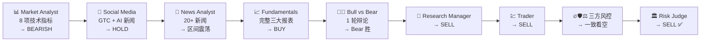
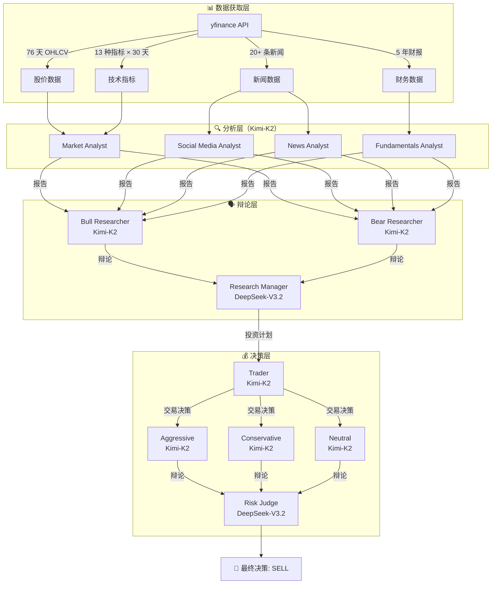

# NVDA 实战分析执行报告

> **运行时间**: 2026-03-24 21:33 — 22:00（约 27 分钟）
> **模型配置**: Deep Think = DeepSeek-V3.2 | Quick Think = Kimi-K2
> **API 平台**: Paratera（并行科技）| **数据源**: yfinance

---

## 执行流水线概览



---

## 阶段 1：Market Analyst（技术分析）

### 输入数据

从 yfinance 获取了 **76 个交易日**（2025-12-01 至 2026-03-22）的 OHLCV 数据：

| 关键日期 | 收盘价 | 事件 |
|---------|--------|------|
| 2025-12-23 | $189.20 | 圣诞反弹高点 |
| 2026-01-20 | $178.06 | 1 月回调低点 |
| 2026-02-25 | **$195.55** | **近期最高点** |
| 2026-02-26 | $184.88 | 单日暴跌 -5.5%（3.6 亿成交量）|
| 2026-02-27 | $177.18 | 连续暴跌（3.1 亿成交量）|
| 2026-03-20 | **$172.70** | **收盘价（分析日前最后交易日）** |

### 选取的 8 个技术指标

| 指标 | 当前值 | 信号 | 分析 |
|------|--------|------|------|
| 200 SMA | $178.59 | 🔴 **BEARISH** | 价格首次跌破 200 日均线 |
| 50 SMA | $184.40 | 🔴 **BEARISH** | 下行中，构成动态阻力 |
| 10 EMA | $179.29 | 🔴 **BEARISH** | 短期疲弱 |
| MACD | -2.26 | 🔴 **BEARISH** | 近一年最极端负值 |
| RSI | 41.98 | 🟡 **中性偏空** | 未能反弹至 50 以上 |
| Bollinger 中轨 | $182.32 | 🔴 **BEARISH** | 价格远低于中轨 |
| ATR | 5.77 | ⚡ **高波动** | 波动性持续上升 |
| Volume | 下降趋势 | 🟡 **中性** | 反弹时成交量不足 |

### Market Analyst 结论

> **Overall Technical Bias: BEARISH** — 多个时间框架指标一致看空，关键支撑已被击穿。

---

## 阶段 2：Social Media Analyst（情绪分析）

### 获取的关键新闻

| 新闻标题 | 来源 | 影响 |
|---------|------|------|
| NVIDIA GTC 大会发展"远超市场认知" | 24/7 Wall St. | 🟢 正面 |
| Meta 270 亿美元 AI 基建合同 | 多个来源 | 🟢 正面 |
| Jensen Huang 称"人类水平 AI 已到来" | Barron's | 🟡 混合 |
| Nvidia 和 Palantir 测试关键阻力位 | IBD | 🔴 技术受阻 |
| 2 只 AI 基建股看起来太便宜了 | 24/7 Wall St. | 🟢 正面 |

### 核心发现

> **信息差**: GTC 大会的技术突破 **未反映在股价中** — 典型的"Show me story"
>
> **情绪分歧**: 技术面看空 vs 基本面看多 → 市场等待催化剂

### Social Media Analyst 结论：**HOLD**

---

## 阶段 3：News Analyst（新闻与宏观分析）

### 宏观环境扫描

| 因素 | 状态 | 对 NVDA 影响 |
|------|------|------------|
| AI 基建支出 | Meta $27B + 持续增长 | 🟢 多年利好 |
| ASML EUV 订单 | 大额订单确认 | 🟢 供应链保障 |
| 阿里巴巴 RISC-V AI 芯片 | 新竞争者出现 | 🟡 长期威胁 |
| **地缘风险缓解** | NVDA/AMD 因"战争恐慌缓解"上涨 | 🟢 风险溢价下降 |
| **板块轮动** | 石油股/红利 ETF 受青睐 | 🔴 成长股承压 |

### News Analyst 结论

> **区间震荡** ($175-$190)，等待下一个催化剂（财报或重大 AI 公告）。

---

## 阶段 4：Fundamentals Analyst（基本面分析）

### 财务数据摘要（来自 yfinance 三大报表）

| 指标 | 数值 | 评价 |
|------|------|------|
| **营收（Q1 2026）** | $681 亿 | YoY +73% 🟢 |
| **毛利率** | 75.0% | 行业领先 🟢 |
| **净利率** | 55.6% | 卓越 🟢 |
| **ROE** | 101.5% | 超高 🟢 |
| **自由现金流** | $349 亿 | 占营收 51% 🟢 |
| **现金储备** | $106 亿 + $520 亿短期投资 | 充裕 🟢 |
| **总负债** | $110 亿 | 仅占总资产 5.3% 🟢 |
| **Forward P/E** | 15.7× | 考虑增速合理 🟡 |
| **Beta** | 2.375 | 高波动 🔴 |

### Fundamentals Analyst 结论：**BUY**

> 基本面极其强劲，AI+数据中心驱动增长，低负债高现金流。

---

## 阶段 5：Bull vs Bear 辩论（1 轮）

### 🐂 Bull Researcher 核心论点

| # | 论点 | 关键数据 |
|---|------|---------|
| 1 | 增长是"已签约的"不是"希望的" | 超级云厂商 2026 年 capex >$3000 亿，NVDA 份额 30-40% |
| 2 | 竞争威胁被夸大 | CUDA 300 万开发者，切换成本以"年"计 |
| 3 | 财务堡垒 | $620 亿现金，净负债率仅 5%，ROE 101% |
| 4 | 技术破位是"颠簸"不是"崩塌" | 2022/10 和 2023/05 也跌破 200 日线，4-6 周内收复 |
| 5 | 宏观只是障眼法 | 美联储仍有 2 次降息预期，历史上 2 年期收益率大降后成长股跑赢 |

**Bull 的交易结构**: 买入 NVDA @$175.64 + 卖 4/25 $190 Call + 买 4/18 $170 Put → 净成本 $171.44，最大盈利 11%，最大亏损 1%

### 🐻 Bear Researcher 核心论点

| # | 论点 | 关键数据 |
|---|------|---------|
| 1 | "签约增长"是幻觉 | 40% 新增 capex 流向自研芯片（TPU/MTIA/Trainium），Forward EPS 6 周被砍 7% |
| 2 | CUDA 护城河正在被跨越 | PyTorch 2.3 已编译 Meta 85% 训练内核，微软 TPU 扩容 3 倍 |
| 3 | 库存风险 | 渠道天数从 28 → 45，台湾现货 H100 跌 11%，交付周期减半 |
| 4 | 技术面首次三线空头排列 | 10 年来首次：50 日线下行 + 200 日线高于股价 = 典型分发形态 |
| 5 | 中国出口管制加码 | 新 BIS 规则（4月4日）降算力门槛，B100 需出口许可 |

**Bear 的交易结构**: 做空 NVDA @$175.64 + 买 4/18 $170 Put + 卖 4/25 $165 Put → 净收入 $0.30，最大盈利 $10.30，最大亏损 $5

---

## 阶段 6：Research Manager 判决（DeepSeek-V3.2）

> **判定：站队 Bear Analyst → SELL**

关键判断逻辑：

1. **辩论转折点**: "签约增长"的有效性 — Bear 成功证伪（EPS 被砍、超级云厂商转向自研）
2. **吸取教训**: 去年因"时机选择太聪明"而错过大行情，但**本次情况相反** — EPS 在向下修正
3. **技术+基本面共振**: 200 日线破位 + 库存上升 + 定价下滑 = 拐点，不是买入机会

---

## 阶段 7：Trader 决策（Kimi-K2）

### Trader 新增的 5 个实时数据点

| # | 新信息 | 意义 |
|---|--------|------|
| 1 | 周五收盘跌破 200 日线，成交量 1.8 倍 | 机构分发，非散户恐慌 |
| 2 | 3 日 Put/Call 比率 1.42（2022/10 以来最高） | 极端看空情绪 |
| 3 | 台湾 H100 现货价再跌 5%，累计 -18% | 定价权丧失 |
| 4 | 美国 10 年期国债收益率回升至 4.5% 以上 | ERP 255bp，高市盈率股承压 |
| 5 | 社交媒体多空比从 7:1 降至 2.3:1 | 3 周内最快衰减 |

### Trader 结论：**SELL** 🔴

> "四条线同时亮红灯：200 日线破位 + EPS 持续下调 + 现货价格下跌 + 上行对冲需求消失"

---

## 阶段 8：三方风控辩论

````carousel
### 🔥 Aggressive Analyst（激进）
**立场: 大力做空**
- "上次 200 日线破位后 18 个月翻倍，但这次不同 — 所有均线空头排列"
- "如果 B100 降价 5%，EPS 从 $11.12 降到 $8.90，35× 变成价值陷阱"
- 建议 2.8% NAV 仓位，April 18 到期

### 关键一击
> "当一个高 Beta 宠儿失去动量护盾，下行空间很少只有 10%"
<!-- slide -->
### 🛡️ Conservative Analyst（保守）
**立场: 谨慎做空，严控仓位**
- "上两次 200 日线破位后平均再跌 28%，需要 6-9 个月才收复"
- "如果增长故事破裂，P/E 压缩到 16× = 目标价 $61"
- 建议仅 25bps NAV，May 16 到期，加 $190 Call 对冲隔夜风险

### 关键一击
> "我们不是为了 80% 的时间正确而领薪水，而是为了在 20% 的尾部风险中活下来"
<!-- slide -->
### ⚖️ Neutral Analyst（中立）
**立场: 等触发信号再做空**
- "Aggressive 你说 EPS 被砍 6.8% 是'暴力'，但真正暴力是 2022 Q3 的 -34%"
- "库存故事是模糊的：NVDA 自己的 DOI 只有 76 天，没到 90 天警戒线"
- 建议等日收低于 $171.72 确认后分 3 批建仓

### 关键一击
> "你不是因为早而获得报酬；你是因为正确而获得报酬"
````

---

## 阶段 9：Risk Judge 最终裁决（DeepSeek-V3.2）

### 最终决策：**SELL** 🔴

### 综合各方意见后的执行计划

| 要素 | 原始方案（Trader） | 优化方案（Risk Judge） |
|------|------------------|---------------------|
| **触发条件** | 立即执行 | 等日收 < $171.72 + 成交量确认 |
| **仓位大小** | 2.8% NAV | **0.75-1.0% NAV** |
| **期权结构** | Apr 18 $170/$165 Put Spread | **May 16 $165/$155 1×2 Put Spread** |
| **对冲** | 无 | **买 $190 Call（0.25% NAV）** |
| **建仓方式** | 一次性 | **分 3 批**（触发 / $165 / $160）|
| **止损** | 周收 > $184 | 周收 > 50 日均线（~$184）|

### 否决 BUY 和 HOLD 的理由

| 选项 | 否决理由 |
|------|---------|
| **BUY** | "弹簧蓄力"论点忽视了减速的新证据，现在买入是同时对抗技术面和基本面 |
| **HOLD** | 技术面显示分发而非蓄力；基本面在恶化（EPS 下修、库存上升）；宏观逆风加大 |

---

## 数据流动全景



---

## 各阶段推荐汇总

| 阶段 | Agent | 推荐 | 使用模型 |
|------|-------|------|---------|
| 技术分析 | Market Analyst | 🔴 BEARISH | Kimi-K2 |
| 情绪分析 | Social Media Analyst | 🟡 HOLD | Kimi-K2 |
| 新闻分析 | News Analyst | 🟡 区间震荡 | Kimi-K2 |
| 基本面 | Fundamentals Analyst | 🟢 BUY | Kimi-K2 |
| 投研辩论 | Bull vs Bear | 🔴 Bear 胜 | Kimi-K2 |
| 投研判决 | Research Manager | 🔴 SELL | DeepSeek-V3.2 |
| 交易决策 | Trader | 🔴 SELL | Kimi-K2 |
| 激进风控 | Aggressive Analyst | 🔴 大力做空 | Kimi-K2 |
| 保守风控 | Conservative Analyst | 🔴 小仓做空 | Kimi-K2 |
| 中立风控 | Neutral Analyst | 🔴 等信号做空 | Kimi-K2 |
| **最终裁决** | **Risk Judge** | **🔴 SELL** | **DeepSeek-V3.2** |

> **值得注意**: 基本面 Agent 给出 BUY，但被后续的辩论和风控环节推翻 — 这正是多 Agent 对抗性设计的价值所在。
