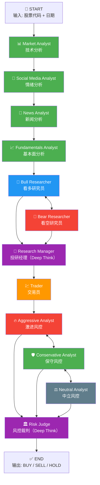

# TradingAgents 系统设计与实现说明书

> 基于 [TauricResearch/TradingAgents](https://github.com/TauricResearch/TradingAgents) v0.2.0 代码分析

---

## 1. 系统概述

TradingAgents 是一个**多 Agent 协作的 LLM 金融交易分析框架**，模拟了真实金融机构的分析决策流程。系统通过 LangGraph 编排多个 AI Agent，从数据采集、多维度分析、多方辩论，到最终风险评估，形成完整的投资决策链。

### 核心设计理念

```
传统基金公司的决策流程：
分析师调研 → 研究员辩论 → 投资经理决策 → 交易员执行 → 风控审核

TradingAgents 的 AI 复刻：
4 个分析师 Agent → Bull/Bear 辩论 → Research Manager 判决 → Trader 决策 → 3 方风控辩论 → Risk Judge 最终裁决
```

---

## 2. 系统架构

### 2.1 整体流程图



### 2.2 目录结构

```
TradingAgents/
├── run_paratera.py              # 启动脚本（Paratera API）
├── tradingagents/
│   ├── default_config.py        # 全局默认配置
│   ├── graph/                   # 🧩 图编排层
│   │   ├── trading_graph.py     # 主入口：初始化所有组件
│   │   ├── setup.py             # LangGraph 工作流构建
│   │   ├── conditional_logic.py # 条件分支逻辑
│   │   ├── propagation.py       # 状态初始化与传播
│   │   ├── reflection.py        # 反思与记忆更新
│   │   └── signal_processing.py # 信号提取（BUY/SELL/HOLD）
│   ├── agents/                  # 🤖 Agent 层
│   │   ├── analysts/            # 4 个分析师
│   │   ├── researchers/         # Bull/Bear 研究员
│   │   ├── managers/            # 投研经理 + 风控裁判
│   │   ├── trader/              # 交易员
│   │   ├── risk_mgmt/           # 3 个风控分析师
│   │   └── utils/               # Agent 状态、记忆、工具
│   ├── dataflows/               # 📊 数据层
│   │   ├── interface.py         # 数据供应商路由
│   │   ├── y_finance.py         # yfinance 数据实现
│   │   ├── yfinance_news.py     # yfinance 新闻获取
│   │   └── alpha_vantage*.py    # Alpha Vantage 备选
│   └── llm_clients/             # 🔌 LLM 客户端层
│       ├── factory.py           # 工厂模式创建客户端
│       └── openai_client.py     # OpenAI 兼容客户端
```

---

## 3. 数据获取与处理

### 3.1 数据源架构

系统采用**供应商抽象 + 路由模式**，通过 [interface.py](file:///Users/jimmy/Github/Fin/TradingAgents/tradingagents/dataflows/interface.py) 统一管理数据供应商：

```
config["data_vendors"] = {
    "core_stock_apis":      "yfinance",     # 股价 OHLCV
    "technical_indicators": "yfinance",     # 技术指标
    "fundamental_data":     "yfinance",     # 基本面
    "news_data":            "yfinance",     # 新闻
}
```

路由逻辑支持按**工具级别**覆盖类别级别配置，并具备**供应商降级**能力（Alpha Vantage 限流时自动降级到 yfinance）。

### 3.2 四大数据类别

| 类别 | 工具函数 | 数据内容 | 来源 |
|------|---------|---------|------|
| **股价数据** | `get_stock_data()` | OHLCV + 分红/拆股 | `yf.Ticker.history()` |
| **技术指标** | `get_indicators()` | SMA/EMA/MACD/RSI/Bollinger/ATR/VWMA/MFI | [stockstats](file:///Users/jimmy/Github/Fin/TradingAgents/tradingagents/dataflows/y_finance.py#274-298) 库计算 |
| **基本面** | [get_fundamentals()](file:///Users/jimmy/Github/Fin/TradingAgents/tradingagents/dataflows/y_finance.py#300-355) / [get_balance_sheet()](file:///Users/jimmy/Github/Fin/TradingAgents/tradingagents/dataflows/y_finance.py#357-385) / [get_cashflow()](file:///Users/jimmy/Github/Fin/TradingAgents/tradingagents/dataflows/y_finance.py#387-415) / [get_income_statement()](file:///Users/jimmy/Github/Fin/TradingAgents/tradingagents/dataflows/y_finance.py#417-445) | PE/EPS/利润率/资产负债表/现金流/利润表 | `yf.Ticker.info` / `.balance_sheet` 等 |
| **新闻** | [get_news()](file:///Users/jimmy/Github/Fin/TradingAgents/tradingagents/dataflows/yfinance_news.py#55-109) / [get_global_news()](file:///Users/jimmy/Github/Fin/TradingAgents/tradingagents/dataflows/yfinance_news.py#111-197) / [get_insider_transactions()](file:///Users/jimmy/Github/Fin/TradingAgents/tradingagents/dataflows/y_finance.py#447-469) | 个股新闻/全球宏观新闻/内部人交易 | `yf.Ticker.get_news()` / `yf.Search()` |

### 3.3 技术指标计算

技术指标通过 [stockstats](https://github.com/jealous/stockstats) 库批量计算，支持 13 种指标：

| 分类 | 指标 | 说明 |
|------|------|------|
| 移动平均 | `close_50_sma`, `close_200_sma`, `close_10_ema` | 中长短期趋势 |
| MACD | `macd`, `macds`, `macdh` | 动量与趋势变化 |
| 动量 | `rsi` | 超买/超卖（70/30 阈值）|
| 波动率 | `boll`, `boll_ub`, `boll_lb`, `atr` | 布林带 + 真实波幅 |
| 成交量 | `vwma`, `mfi` | 量价关系 |

数据处理流程：下载 15 年历史数据 → 本地缓存为 CSV → stockstats 批量计算 → 按日期查询返回。

---

## 4. Agent 设计与实现

### 4.1 两种 LLM 角色

| 角色 | 使用模型 | 使用场景 | 特点要求 |
|------|---------|---------|---------|
| **Quick Think** | Kimi-K2 | 4 个分析师、Bull/Bear 研究员、Trader、3 个风控分析员 | 快速响应、工具调用能力强 |
| **Deep Think** | DeepSeek-V3.2 | Research Manager、Risk Judge | 综合推理、深度分析 |

### 4.2 阶段一：数据分析（4 个分析师）

四个分析师**串行执行**，每个分析师可通过工具循环调用获取数据：

````carousel
**📊 Market Analyst（技术分析师）**

- **工具**: `get_stock_data`, `get_indicators`
- **流程**: 获取 OHLCV → 选择最多 8 个互补指标 → 生成技术分析报告
- **输出**: 趋势判断 + 支撑/阻力位 + Markdown 汇总表
- **特色**: Prompt 要求"不要简单说趋势混合，要给出细粒度分析"
<!-- slide -->
**💬 Social Media Analyst（情绪分析师）**

- **工具**: `get_news`
- **流程**: 获取近期新闻 → 分析社交媒体情绪
- **输出**: 市场情绪报告
<!-- slide -->
**📰 News Analyst（新闻分析师）**

- **工具**: `get_news`, `get_global_news`, `get_insider_transactions`
- **流程**: 获取个股新闻 + 全球宏观新闻 + 内部人交易 → 综合分析
- **输出**: 新闻事件影响评估 + 宏观经济展望
<!-- slide -->
**📈 Fundamentals Analyst（基本面分析师）**

- **工具**: `get_fundamentals`, `get_balance_sheet`, `get_cashflow`, `get_income_statement`
- **流程**: 获取估值 + 三大财报 → 分析财务健康度
- **输出**: 盈利能力 / 估值水平 / 增长趋势 / 风险因素
````

### 4.3 阶段二：投研辩论（Bull vs Bear）

```
分析师报告 ──→ Bull Researcher ──→ Bear Researcher ──→ (循环 N 轮)
                    ↑                     │
                    └─────────────────────┘
                              │
                              ↓
                     Research Manager（判决）
```

- **Bull Researcher**: 基于四份报告 + 过去记忆，构建看多论据
- **Bear Researcher**: 同上，构建看空论据，反驳 Bull 的观点
- **辩论轮数**: `max_debate_rounds`（默认 1 轮，即 Bull → Bear，共 2 次发言）
- **Research Manager**（Deep Think）: 评估双方论据，给出 BUY/SELL/HOLD + 详细投资计划

### 4.4 阶段三：交易员决策

Trader 接收 Research Manager 的投资计划，结合过去交易记忆，做出具体交易建议（必须以 `FINAL TRANSACTION PROPOSAL: **BUY/HOLD/SELL**` 结尾）。

### 4.5 阶段四：风控辩论（三方辩论）

```
Trader 决策 ──→ Aggressive ──→ Conservative ──→ Neutral ──→ (循环 N 轮)
                    ↑                                │
                    └────────────────────────────────┘
                                    │
                                    ↓
                           Risk Judge（最终裁决）
```

- **Aggressive Analyst**: 激进视角，倾向高风险高回报
- **Conservative Analyst**: 保守视角，强调风险控制
- **Neutral Analyst**: 中立视角，平衡收益与风险
- **Risk Judge**（Deep Think）: 最终裁决，输出 `final_trade_decision`

### 4.6 信号提取

[SignalProcessor](file:///Users/jimmy/Github/Fin/TradingAgents/tradingagents/graph/signal_processing.py) 从 Risk Judge 的长文本决策中提取简洁的 `BUY` / `SELL` / `HOLD` 信号。

---

## 5. 状态管理

### 5.1 全局状态（AgentState）

基于 LangGraph 的 `MessagesState` 扩展，包含：

```python
class AgentState(MessagesState):
    company_of_interest: str        # 股票代码
    trade_date: str                 # 交易日期
    market_report: str              # 技术分析报告
    sentiment_report: str           # 情绪分析报告
    news_report: str                # 新闻分析报告
    fundamentals_report: str        # 基本面分析报告
    investment_debate_state: InvestDebateState   # 投研辩论状态
    investment_plan: str            # 投资计划
    trader_investment_plan: str     # 交易员计划
    risk_debate_state: RiskDebateState           # 风控辩论状态
    final_trade_decision: str       # 最终决策
```

### 5.2 辩论状态

| 状态 | 字段 | 说明 |
|------|------|------|
| **InvestDebateState** | `bull_history`, `bear_history`, `history`, `count`, `judge_decision` | Bull/Bear 各自历史 + 汇总 |
| **RiskDebateState** | `aggressive_history`, `conservative_history`, `neutral_history`, `count`, `judge_decision` | 三方各自历史 + 汇总 |

---

## 6. 记忆与反思系统

### 6.1 记忆存储

每个关键 Agent 都配有独立的 [FinancialSituationMemory](file:///Users/jimmy/Github/Fin/TradingAgents/tradingagents/agents/utils/memory.py)：

| Agent | 记忆实例 |
|-------|---------|
| Bull Researcher | `bull_memory` |
| Bear Researcher | `bear_memory` |
| Trader | `trader_memory` |
| Research Manager | `invest_judge_memory` |
| Risk Judge | `risk_manager_memory` |

记忆使用 **BM25 词法相似度** 检索（无需 API 调用，离线运行）。每次决策时检索最相似的 2 条历史经验。

### 6.2 反思机制

交易完成后，调用 [reflect_and_remember(returns_losses)](file:///Users/jimmy/Github/Fin/TradingAgents/tradingagents/graph/trading_graph.py#263-280) 触发反思：

```
实际收益 ──→ Reflector ──→ 分析每个 Agent 的决策是否正确
                              ──→ 生成改进建议
                              ──→ 存入对应 Agent 的记忆
```

反思 Prompt 要求分析：市场情报、技术指标、价格走势、新闻分析、情绪分析、基本面数据，并给出改进建议。

---

## 7. LLM 客户端架构

### 7.1 工厂模式

```python
create_llm_client(provider, model, base_url) → BaseLLMClient
```

| Provider | 实现类 | 支持 |
|----------|--------|------|
| `openai` | OpenAIClient | 原生 OpenAI + 任意 OpenAI 兼容 API |
| `openrouter` | OpenAIClient | OpenRouter 免费模型 |
| `ollama` | OpenAIClient | 本地 Ollama |
| `xai` | OpenAIClient | Grok 系列 |
| `anthropic` | AnthropicClient | Claude 系列 |
| `google` | GoogleClient | Gemini 系列 |

### 7.2 Paratera 配置方式

Paratera 作为 OpenAI 兼容 API，使用 `provider="openai"` + 自定义 `backend_url`：

```python
config["llm_provider"] = "openai"
config["backend_url"] = "https://llmapi.paratera.com/v1"
# OPENAI_API_KEY 从 .env 自动读取
```

---

## 8. 条件分支与流程控制

[ConditionalLogic](file:///Users/jimmy/Github/Fin/TradingAgents/tradingagents/graph/conditional_logic.py) 控制工作流分支：

| 方法 | 逻辑 |
|------|------|
| `should_continue_market/social/news/fundamentals` | 如果 LLM 返回了 `tool_calls` → 继续调用工具；否则 → 清除消息，进入下一个分析师 |
| [should_continue_debate](file:///Users/jimmy/Github/Fin/TradingAgents/tradingagents/graph/conditional_logic.py#46-56) | 辩论次数 ≥ `2 × max_rounds` → Research Manager；根据最后发言者决定下一个发言 |
| [should_continue_risk_analysis](file:///Users/jimmy/Github/Fin/TradingAgents/tradingagents/graph/conditional_logic.py#57-68) | 辩论次数 ≥ `3 × max_rounds` → Risk Judge；三方轮流发言 |

---

## 9. 输出与日志

### 9.1 运行结果

结果保存在：
```
eval_results/{TICKER}/TradingAgentsStrategy_logs/full_states_log_{DATE}.json
```

包含完整的分析链路（四份报告 + 辩论历史 + 投资计划 + 风控辩论 + 最终决策）。

### 9.2 数据缓存

技术指标的 15 年历史数据缓存在：
```
tradingagents/dataflows/data_cache/{SYMBOL}-YFin-data-{START}-{END}.csv
```

---

## 10. 当前部署配置

| 配置项 | 值 |
|--------|-----|
| API 平台 | Paratera（并行科技）|
| API 地址 | `https://llmapi.paratera.com/v1` |
| Deep Think 模型 | `DeepSeek-V3.2` |
| Quick Think 模型 | `Kimi-K2` |
| 数据源 | yfinance（免费）|
| 辩论轮数 | 1 轮 |
| 风控讨论轮数 | 1 轮 |

---

## 11. 关键设计特点

1. **模拟真实投资机构**：四分析师→辩论→决策→风控，完整复刻基金公司流程
2. **对抗性辩论**：Bull/Bear + 激进/保守/中立，通过对抗避免单一偏见
3. **记忆与反思**：BM25 检索历史经验，Agent 从过去错误中学习
4. **数据供应商抽象**：支持 yfinance / Alpha Vantage，可扩展
5. **LLM 供应商无关**：工厂模式支持 OpenAI / Anthropic / Google / 任意 OpenAI 兼容 API
6. **深浅分工**：分析师用快速模型（成本低），关键决策用深度模型（质量高）
