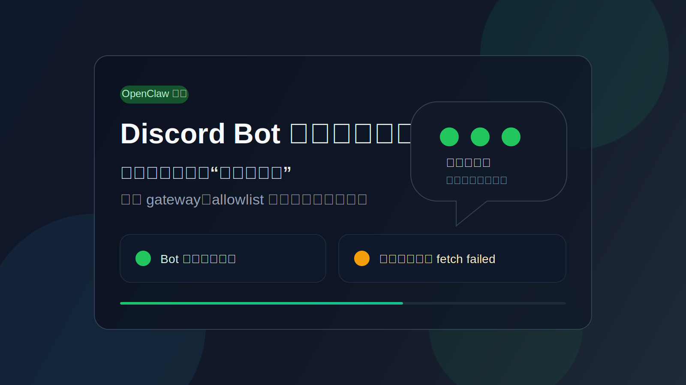

*一类非常典型的“半通半断”故障：Bot 已在线、消息能进模型，但最终回复没有成功发回 Discord。*

> **核心结论：这不是一个单点故障，而是四层问题叠加。真正最隐蔽的根因是，OpenClaw 当前链路里 Discord 的入站与登录可以走代理，但最终出站回复没有完整继承代理，导致“能登录、能收消息、模型也跑了，但发不出去”。**

> **适合谁看：** 正在把 OpenClaw 接入 Discord、已经看到 bot 在线、但 `@bot hello` 没有任何回复的人。

> **你会得到什么：** 一套可以复用的排障顺序，一份最小可用修复配置，以及一段让 OpenClaw 自己快速自查的提示词。

最近把 OpenClaw 接到 Discord 时，遇到一个非常典型、也非常容易误判的问题：

- OpenClaw 桌面端先报“无法连接到 server / gateway 出问题”
- Discord 里的 bot 一开始是灰的
- 修完一轮之后 bot 变绿了
- 但在服务器里 `@MacClaw hello` 还是完全没有回复

最后确认，这不是 Discord 单独坏了，也不是 token 单独错了，而是四层链路分别出了问题：

1. 本地 gateway 没稳定跑起来
2. `openclaw.json` 里混入了当前版本不支持的 Discord 配置字段
3. Discord 服务器消息被 `allowlist` 策略挡掉
4. Discord 出站回复没有真正走代理，导致“能收不能发”

如果你也遇到“bot 在线但不回复”的问题，这篇可以直接当 runbook 用。

## 1. 先说本质：为什么这个问题特别容易误判

这次故障最迷惑人的地方，在于每一层看起来都“像是快好了”。

### 1.1 Bot 变绿，不代表链路已经通了

很多人看到 Discord 里 bot 从灰色变成绿色，就会默认“服务已经好了”。

其实这只能说明一件事：**Discord 登录成功了。**

它不代表：

- OpenClaw 的群聊策略已经放行
- Discord 消息一定能进入 agent
- agent 跑完之后一定能把回复发回 Discord

也就是说，“在线”只是链路中的一个中间状态，不是最终成功。

### 1.2 “能收到消息”和“能发出消息”是两回事

这次最关键的坑，是 Discord 的入站和出站表现不一致。

在这台机器上：

- 浏览器访问 Discord 没问题
- 命令行 / Node 直连 Discord 会超时
- 只能通过本地代理 `127.0.0.1:7897` 访问 Discord

而 OpenClaw 当前版本里，不同链路对代理的支持并不完全一致：

- provider 启动和一部分 REST 探测可以走 `channels.discord.proxy`
- gateway WebSocket 也可以走 `channels.discord.proxy`
- 但最终发消息的那条出站链路，没有完整继承这个 proxy 配置

结果就出现一个非常误导人的状态：

- bot 在线
- 你 `@` 它
- 模型其实跑完了
- 但最后回复发不出去

看起来像“机器人没工作”，实际上是“机器人工作完了但发不出去”。

## 2. 这次故障的完整表象

按照时间顺序，这次一共经历了 4 个阶段。

### 阶段一：OpenClaw 桌面端连不上本地 server

最开始，桌面端提示：

- 无法连接到 server
- gateway 出问题

这类报错不要先去看 Discord，因为 Discord 只是 gateway 上的一条 channel。只要本地 `127.0.0.1:18789` 没监听，前面的桌面端和后面的 Discord 都不可能正常。

第一组检查命令应该是：

```bash
lsof -iTCP:18789 -sTCP:LISTEN -nP
launchctl print gui/$(id -u)/ai.openclaw.gateway
```

### 阶段二：Discord provider 连启动都起不来

后面在日志里连续看到 schema 报错：

```text
channels.discord.intents: Invalid input: expected object, received array
channels.discord: Unrecognized key: "applicationId"
```

这说明 `~/.openclaw/openclaw.json` 里混入了旧版本或错误格式的 Discord 配置，导致 provider 在启动阶段直接退出。

这一阶段 Discord 客户端中的 bot 通常是灰色的，因为它根本没真正登录成功。

### 阶段三：Bot 变绿了，但服务器里不回

修掉 schema 问题后，Discord 里的 bot 终于在线了。

但这时群里依然出现：

```text
@MacClaw hello
没有任何回复
```

这一步最容易把问题误判成：

- bot 权限不够
- Message Content Intent 没开
- token 失效
- Discord 官方抽风

但这次的真正原因不是这些。

### 阶段四：日志显示模型跑完了，但回复发不出去

进一步查日志，出现了这组关键证据：

```text
embedded run agent end: ... isError=false
discord final reply failed: TypeError: fetch failed
```

这两行合起来已经足够下结论：

- 消息进来了
- agent 跑完了
- 不是模型问题
- 真正坏的是“最终发回 Discord”

到这里，问题范围已经被压缩得非常小了。

## 3. 真正的根因拆解

### 3.1 根因一：gateway 本身不稳定

桌面端连不上 server 的本质，是 gateway 没稳定常驻。

期间 `launchd` 的状态也很不稳定，出现过：

- 服务显示 loaded，但端口不监听
- 端口曾经监听，但之后又消失
- `channels status` 超时或 `1006 abnormal closure`

也就是说，如果 OpenClaw 本体都没活着，Discord 当然不会回复。

### 3.2 根因二：配置文件里有当前版本不支持的字段

这次实际踩到的两个坏配置分别是：

```json
"channels": {
  "discord": {
    "intents": ["..."]
  }
}
```

和：

```json
"channels": {
  "discord": {
    "applicationId": "..."
  }
}
```

在当前 OpenClaw 版本里：

- `intents` 不能是旧数组格式
- `applicationId` 直接是非法字段

这些都会导致 Discord channel 无法正常启动。

### 3.3 根因三：群聊策略默认就是拦截的

这是第二个大坑。

只要 `channels.discord` 被显式配置，当前 OpenClaw 的群聊安全基线就是：

```json
"groupPolicy": "allowlist"
```

它意味着：

- bot 被邀请进服务器，不代表可以处理服务器消息
- 如果 `channels.discord.guilds` 没配，群聊消息默认直接拒绝

也就是说，“bot 在服务器里”和“bot 能在服务器里工作”是两件不同的事情。

这次修复前，`groupPolicy` 已经是 `allowlist`，但 `guilds` 为空，所以服务器消息天然被挡住了。

### 3.4 根因四：最隐蔽的 bug，在出站代理覆盖不完整

这是整次故障里最关键的一层。

在这台机器上，Discord 访问必须走代理：

```text
http://127.0.0.1:7897
```

而 OpenClaw 当前链路表现为：

- 登录和一部分 REST 探测会走 `channels.discord.proxy`
- Gateway WebSocket 也会走 `channels.discord.proxy`
- 但最终 `sendMessageDiscord` 那条出站链路没有自动继承这个代理

所以运行结果就变成：

- provider 能启动
- bot 能在线
- 群聊消息能进 agent
- agent 处理结束
- 但回复发回 Discord 时 `fetch failed`

这是最典型的“半通半断”网络问题。

## 4. 实际怎么修

### 4.1 先把 `openclaw.json` 修成最小稳定版本

这次最后保留下来的核心配置是：

```json
{
  "channels": {
    "discord": {
      "enabled": true,
      "token": "YOUR_BOT_TOKEN",
      "proxy": "http://127.0.0.1:7897",
      "groupPolicy": "allowlist",
      "guilds": {
        "1093345194209968218": {
          "requireMention": true
        },
        "1477719563461202112": {
          "requireMention": true
        }
      },
      "commands": {
        "native": false,
        "nativeSkills": false
      }
    }
  }
}
```

这里做了三件重要的事：

1. 移除所有当前版本不支持的 Discord 字段
2. 把目标服务器显式加入 `guilds`
3. 先关闭 native command 自动部署，减少额外 REST 噪音

### 4.2 用日志验证“消息已经进模型”

不要盲目靠感觉判断，要看日志。

只要出现这一类记录，就说明入站链路已经没问题了：

```text
embedded run start ... messageChannel=discord
embedded run agent end ... isError=false
```

看到这里之后，不要再怀疑 token、mention、guild allowlist 这些已经通过的层，直接去查出站。

### 4.3 给整个 gateway 进程注入标准代理环境变量

因为最终出站链路没有完整吃到 `channels.discord.proxy`，所以最稳妥的修法不是继续改业务配置，而是让 gateway 整个进程都运行在代理环境里。

也就是：

```bash
HTTP_PROXY=http://127.0.0.1:7897
HTTPS_PROXY=http://127.0.0.1:7897
ALL_PROXY=http://127.0.0.1:7897
```

先做快速验证：

```bash
HTTP_PROXY=http://127.0.0.1:7897 \
HTTPS_PROXY=http://127.0.0.1:7897 \
ALL_PROXY=http://127.0.0.1:7897 \
openclaw message send --channel discord --target channel:<CHANNEL_ID> --message "test"
```

如果这一条能成功，基本就已经证明问题是“出站代理没覆盖”。

### 4.4 让 gateway 以带代理环境的方式常驻

由于这次 `launchd` 状态不稳定，先采用了一个最直接可控的方式：

```bash
screen -dmS openclaw-gateway \
  env HTTP_PROXY=http://127.0.0.1:7897 HTTPS_PROXY=http://127.0.0.1:7897 ALL_PROXY=http://127.0.0.1:7897 \
  /opt/homebrew/bin/openclaw gateway run --port 18789
```

验证方法：

```bash
screen -ls | rg openclaw-gateway
lsof -iTCP:18789 -sTCP:LISTEN -nP
```

只要端口在监听，且日志里出现：

```text
logged in to discord as ...
```

就可以去 Discord 里重新测试。

## 5. 这次排障最值得复用的思路

### 5.1 一定要按层拆问题

这类故障如果不分层，会陷入无休止重启。

正确顺序应该是：

1. gateway 是否活着
2. Discord provider 是否启动成功
3. guild allowlist 是否放行
4. 入站消息是否进入 agent
5. agent 是否执行完成
6. 出站回复是否发回 Discord

每一层只要被日志证明已经通过，就不要回头重复怀疑。

### 5.2 对“fetch failed”要保持怀疑，不要马上怪 token

`fetch failed` 是个非常误导人的错误。

它可能是：

- token 错
- DNS 问题
- 网络问题
- 代理没生效
- 只覆盖了部分请求

这次就是最典型的第四种和第五种：

- 登录相关请求能走代理
- 发消息请求没完整走代理

### 5.3 OpenClaw 的群聊安全默认值比你想象中更严格

如果你是第一次把 OpenClaw 放进 Discord 服务器，一定要记住：

- bot 被邀请进去，不等于它被允许处理群消息
- `groupPolicy: allowlist` 是安全基线
- `channels.discord.guilds` 不配，群聊默认就是拒绝

这是安全设计，不是 bug。

## 6. 快速修复清单

如果你只想快速恢复，不想看完整实录，可以直接按这个顺序做。

### Step 1：检查 gateway

```bash
lsof -iTCP:18789 -sTCP:LISTEN -nP
```

如果没监听，先修 gateway。

### Step 2：检查 Discord 配置合法性

重点排查：

- `channels.discord.intents`
- `channels.discord.applicationId`
- 其他当前版本不支持的字段

### Step 3：检查 guild allowlist

确认：

```json
"channels": {
  "discord": {
    "groupPolicy": "allowlist",
    "guilds": {
      "<YOUR_GUILD_ID>": {
        "requireMention": true
      }
    }
  }
}
```

### Step 4：检查是否是“能收不能发”

如果日志里有：

```text
embedded run agent end ... isError=false
discord final reply failed: TypeError: fetch failed
```

直接去查代理。

### Step 5：给 gateway 进程注入代理

```bash
HTTP_PROXY=http://127.0.0.1:7897
HTTPS_PROXY=http://127.0.0.1:7897
ALL_PROXY=http://127.0.0.1:7897
```

## 7. 给 OpenClaw 自查用的一段提示词

下面这段提示词，可以直接交给 OpenClaw 自己做快速排障：

```text
请帮我排查 OpenClaw 的 Discord 不回复问题，按下面顺序执行，不要跳步：

1. 先检查本地 gateway 是否存活：
   - 确认 127.0.0.1:18789 是否监听
   - 检查 gateway 进程和最近日志

2. 检查 ~/.openclaw/openclaw.json 的 Discord 配置是否合法：
   - 是否有当前版本不支持的字段
   - channels.discord.intents 是否为错误格式
   - channels.discord.applicationId 是否存在

3. 检查 Discord provider 是否真的登录成功：
   - 在日志中查找 “starting provider”
   - 查找 “logged in to discord”
   - 查找 “failed to fetch bot identity”
   - 查找 “channel exited”

4. 如果 bot 在线但群里不回复，检查群聊策略：
   - channels.discord.groupPolicy 是否是 allowlist
   - channels.discord.guilds 是否包含当前服务器
   - 当前 guild 是否 requireMention

5. 检查消息链路是否走通：
   - 是否收到入站消息
   - 是否进入 agent run
   - agent 是否执行成功
   - 是否在最终回复阶段报 “discord final reply failed”

6. 如果报 fetch failed，重点检查代理：
   - 浏览器能否访问 discord.com
   - curl/Node 是否必须通过代理访问 discord.com
   - channels.discord.proxy 是否已配置
   - gateway 进程是否带有 HTTP_PROXY / HTTPS_PROXY / ALL_PROXY

7. 给我一个明确结论：
   - 根因是什么
   - 证据是什么
   - 需要改哪些配置
   - 改完后如何验证

请优先给出最小可用修复，不要一开始就做大改动。
```

## 8. 最后总结

这次问题看起来是“Discord bot 不回消息”，但真正本质是一个多层链路的部分失效：

- gateway 一度没稳定运行
- 配置里混入了旧字段
- guild allowlist 没配，群聊默认被挡
- 出站回复代理覆盖不完整，导致最终发不出去

这类问题最忌讳的不是技术难，而是诊断顺序错。

只要按下面这个顺序拆：

- gateway
- provider
- allowlist
- 入站
- agent
- 出站
- 代理

问题通常都会很快收敛。

如果你也碰到“bot 在线但不回复”，不要第一时间去怀疑 Discord 本身，先确认它是不是已经“处理完了，只是回不出来”。
