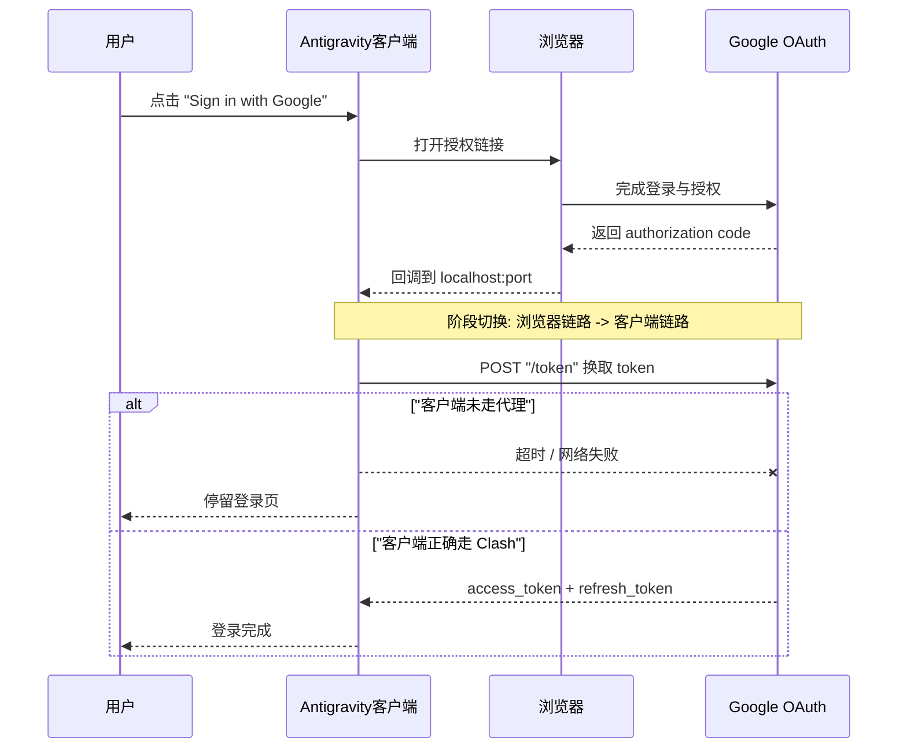
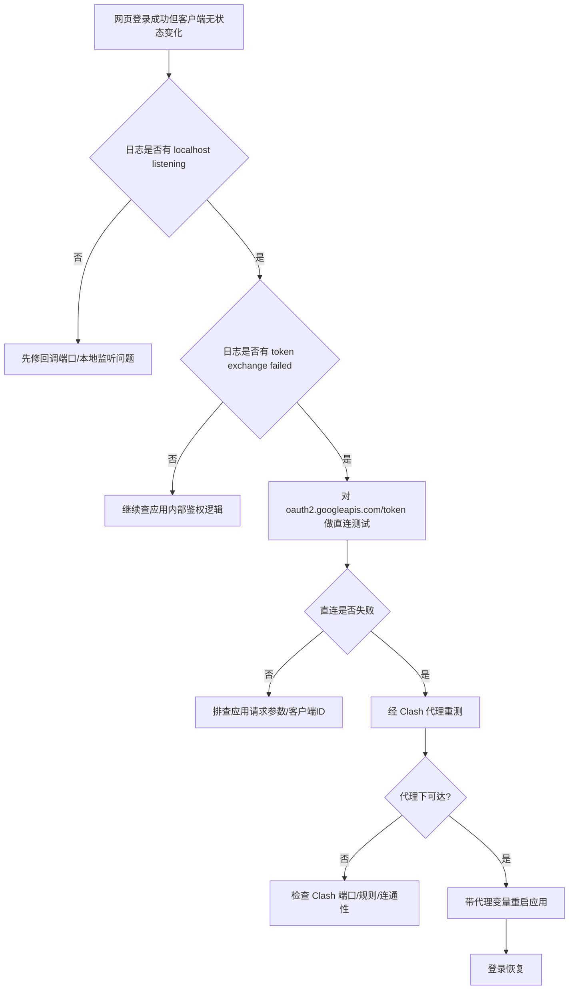

最近在 macOS 上安装 Google Antigravity 后，我遇到一个非常迷惑的问题：

- 应用里点 Google 登录，会弹浏览器；
- 网页端登录成功；
- 回到客户端却始终不进入已登录状态。

这类问题最坑的地方在于：用户体验像“按钮失效”，但实际上是 OAuth 流程只完成了一半。  
下面按“现象 -> 证据 -> 原理 -> 修复 -> 永久化”的顺序拆开讲。

## TL;DR

故障本质：`authorization code` 已拿到，但 `code -> token` 失败。  
失败原因：Antigravity 进程没有使用 Clash 代理访问 `oauth2.googleapis.com/token`。  
直接修复：带 `HTTP_PROXY/HTTPS_PROXY/NO_PROXY` 启动 Antigravity。

## 1. 现象与误判点

表面现象：

- Google 网页登录和授权都成功；
- 客户端仍停留登录页，看起来“无响应”。

高频误判：

- 误判为 Google 账号异常；
- 误判为 Antigravity 的 OAuth 配置错误；
- 误判为 localhost 回调端口冲突。

这些误判共同问题是：只看到了“前半段流程成功”，没有验证“后半段 token 交换”。

## 2. 证据链：如何锁定到 token 交换阶段

### 2.1 回调链路是通的

日志出现：

- `Localhost server listening on port ...`

这说明应用已经在本机监听回调端口，浏览器返回 code 的链路正常。

### 2.2 真正挂的是换 token 请求

日志关键错误：

- `[OAuth] Token exchange failed: request to https://oauth2.googleapis.com/token failed`

这条日志直接把失败阶段定位到 `POST /token`。

### 2.3 连通性对比验证

对同一个 endpoint 做两组测试：

- 直连：超时或失败；
- 代理（Clash `127.0.0.1:7897`）：可达。

因此结论收敛为：不是 OAuth 协议错，而是客户端进程网络出口错。

## 3. 原理图：为什么浏览器成功但客户端失败

浏览器和桌面客户端是两个独立进程，代理策略可能完全不同。  
浏览器能访问 Google，不代表客户端进程也能访问。



## 4. 排查流程（可复用）



## 5. 修复方案

### 5.1 立即修复（当前会话）

```bash
HTTP_PROXY=http://127.0.0.1:7897 \
HTTPS_PROXY=http://127.0.0.1:7897 \
NO_PROXY=localhost,127.0.0.1 \
open -a Antigravity
```

解释：

- `HTTP_PROXY` / `HTTPS_PROXY`：确保外网请求经 Clash；
- `NO_PROXY`：保证 localhost 回调不被代理，避免回环链路异常。

### 5.2 稳定化做法（减少反复崩）

把启动命令固化成一个脚本，例如 `~/bin/open-antigravity`：

```bash
#!/usr/bin/env bash
export HTTP_PROXY=http://127.0.0.1:7897
export HTTPS_PROXY=http://127.0.0.1:7897
export NO_PROXY=localhost,127.0.0.1
exec open -a Antigravity
```

以后统一走该入口启动，避免“今天能登、明天又不行”。

## 6. 验证闭环（不要只看 UI）

完成修复后至少做三步验证：

1. 客户端日志不再出现 `token exchange failed`；
2. 登录后客户端出现已登录态（而不是仅浏览器显示成功）；
3. 重启应用后再次登录，结果一致。

如果只验证“这一次成功”，不验证“重启后仍成功”，问题很容易复发。

## 7. 常见坑位清单

| 坑位 | 现象 | 处理 |
|---|---|---|
| Clash 端口不是 `7897` | 代理命令无效 | 先查实际端口再设环境变量 |
| 漏设 `NO_PROXY` | 回调异常、偶发失败 | 固定 `localhost,127.0.0.1` |
| 直接点 Dock 图标启动 | 偶发复发 | 改为脚本统一启动 |
| 只看网页成功 | 误判已修复 | 以客户端 token 成功为准 |

## 结语

这类故障不是“Google 登录坏了”，而是“认证流程跨进程后网络出口不一致”。  
抓住这个本质，排查速度会从“盲试”变成“分钟级定位”。
