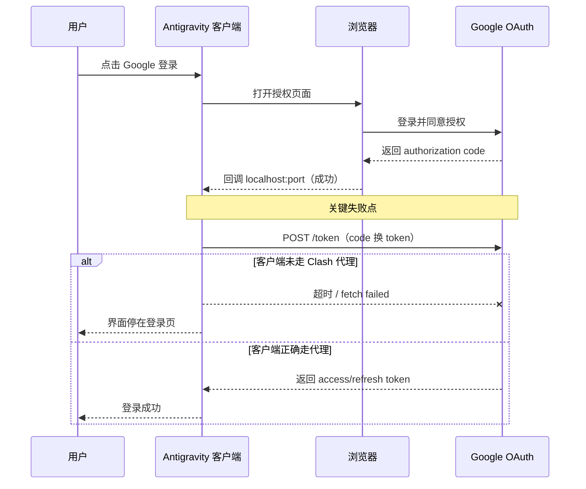

最近在 macOS 上安装 Google Antigravity 后，我遇到一个非常迷惑的问题：

- 应用里点 Google 登录，会弹浏览器；
- 网页端登录成功；
- 回到客户端却始终不进入已登录状态。

这篇文章把问题、证据、原理和修复路径完整记录下来，给后来人少踩坑。

## 先说结论（TL;DR）

这不是账号问题，也不是“你没点对”。  
根因是 OAuth 最后一步 `code -> token` 时，Antigravity 客户端进程没有正确走 Clash 代理，导致请求 `https://oauth2.googleapis.com/token` 超时。

---

## 一、故障表象

- Antigravity 可正常启动；
- 点击 `Sign in with Google`；
- 浏览器里 Google 登录与授权都成功；
- 回到 Antigravity 仍停留登录页，像“没有反应”。

---

## 二、证据链（怎么确定是网络出口问题）

### 1) 本地 OAuth 回调服务正常

日志出现：

- `Localhost server listening on port ...`

说明浏览器回传 `authorization code` 到本机回调端口这一步没问题。

### 2) 真正失败点在 token 交换

日志关键报错：

- `[OAuth] Token exchange failed: request to https://oauth2.googleapis.com/token failed`

说明拿到 code 之后，客户端向 Google 换 token 失败。

### 3) 连通性验证收敛根因

- 直连 `oauth2.googleapis.com`：超时；
- 通过 Clash（`127.0.0.1:7897`）：可达。

结论：不是 OAuth 流程整体坏了，而是客户端进程网络出口没走到正确代理。

---

## 三、原理普及：为什么“网页登录成功”但“客户端失败”？

OAuth 本机登录常见流程：

1. 客户端发起登录，拉起浏览器；
2. 浏览器完成 Google 认证与授权；
3. Google 回调 `localhost:随机端口`，把 `authorization code` 交回本机应用；
4. 应用用 code 请求 `https://oauth2.googleapis.com/token` 换取 access/refresh token。

你卡在第 4 步。

关键点：浏览器和客户端是两个进程，网络配置不一定一致。  
浏览器可能已经走代理，但客户端未必继承同样代理环境，于是就会出现“网页成功、客户端没反应”。



---

## 四、修复方案（可直接用）

用代理环境变量启动 Antigravity：

```bash
HTTP_PROXY=http://127.0.0.1:7897 \
HTTPS_PROXY=http://127.0.0.1:7897 \
NO_PROXY=localhost,127.0.0.1 \
open -a Antigravity
```

说明：

- `HTTP_PROXY / HTTPS_PROXY`：外网请求走 Clash；
- `NO_PROXY=localhost,127.0.0.1`：本地回调不走代理，避免回调链路被错误转发；
- 这是当前终端会话启动方式，不是系统级永久代理。

---

## 五、可复用排查清单（同类问题通用）

1. 日志里是否有 `token exchange failed`；
2. 日志里是否有 `localhost server listening on port ...`；
3. 先确认 Clash 端口是否真是 `7897`（很多机器会改端口）；
4. 直连 token endpoint 是否超时；
5. 经本地代理是否可达；
6. 用代理变量启动客户端后重试登录。

---

## 六、常见误区

- 误区 1：网页都登录了，客户端肯定没问题  
  错。网页成功只证明浏览器链路成功，不代表客户端链路成功。

- 误区 2：看到 localhost 回调成功就等于 OAuth 完整成功  
  错。回调成功只到 code，真正完成登录还要 code 换 token。

- 误区 3：只要开着 Clash 就万事大吉  
  错。关键是目标进程是否实际使用了代理。

---

## 一句话总结

这类“网页已登录但客户端没反应”的故障，核心通常不是认证本身，而是 OAuth 后半程（token 交换）的网络出口与代理配置不一致。
