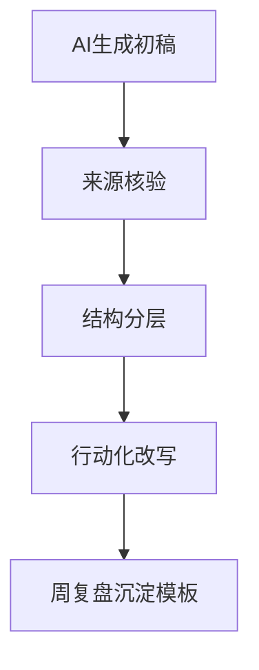

这篇老日记的价值在今天更明显：  
生成型 AI 让“记得快”变简单，但“记得准、记得久”反而更难。

## 三个关键门槛

1. 来源门槛：结论必须可追溯。  
2. 结构门槛：事实、判断、行动要分层。  
3. 回收门槛：周复盘要把笔记转成方法卡片。

## 笔记系统流程

## 一个最低可用标准

| 项目 | 最低要求 |
|---|---|
| 来源 | 至少1个原文链接 |
| 判断 | 至少1条反方或边界 |
| 行动 | 至少1个可执行步骤 |

当这三条成立，AI 才不是“笔记制造机”，而是“学习放大器”。

原始日记：<https://www.douban.com/note/846716357/>
