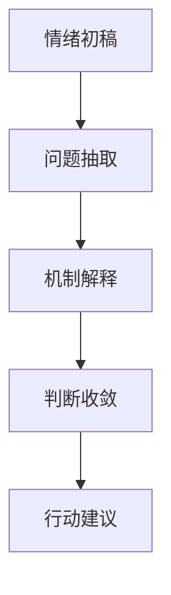

“乘兴而来”是许多好文字的起点。  
真正拉开差距的，不是起点，而是后续有没有“结构回收”。

## 常见断点

1. 情绪很真，但问题不清。  
2. 语言有力，但缺少机制。  
3. 写完即止，无法复用。

## 两段式写作法

### 第一段：现场书写

不打断情绪流，只做完整表达。

### 第二段：结构回收

补齐四个问题：

1. 我在回应什么核心问题？  
2. 这件事背后的机制是什么？  
3. 我现在的判断是什么？  
4. 下一步可执行动作是什么？

## 一个实用标准

如果文章能回答“读完后下一步做什么”，它就已经从情绪表达升级为结构表达。

