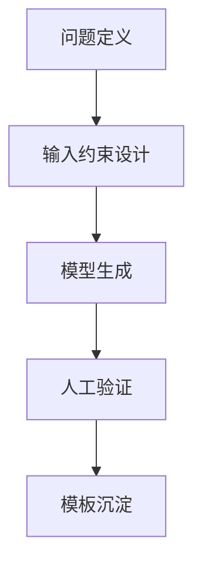

AI 入门最常见误区不是不会用，而是“什么都能用一点，什么都没真正解决”。

## 问题驱动模板

1. 目标：本次调用想降低什么成本。  
2. 约束：准确性、风格、长度边界。  
3. 验证：如何定义“这次调用有效”。

## 一个实操建议

每次只优化一个场景（例如会议纪要、代码解释、文案压缩），  
连续迭代 10 次，比散点试 50 个功能更有效。

原始日记：<https://www.douban.com/note/846554026/>
