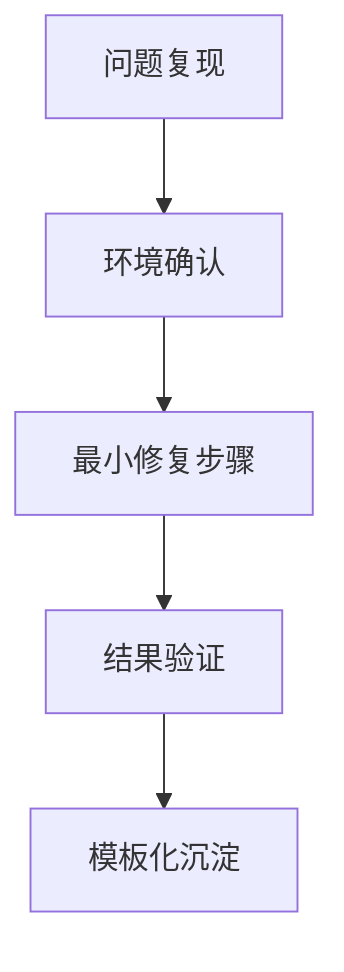

技术写作常见问题是“故事很多，步骤很少”。  
这种记录对当下有意义，对未来几乎无效。

## 最小可复现模板

1. 环境：系统/版本/依赖。  
2. 操作：编号步骤。  
3. 验证：每步成功标志。  
4. 回滚：失败恢复路径。

```mermaid
flowchart TD
    A["问题复现"] --> B["环境确认"]
    B --> C["最小修复步骤"]
    C --> D["结果验证"]
    D --> E["模板化沉淀"]
```

## 结论

技术日记不是“学习证明”，  
而是“下次故障时的应急手册”。

