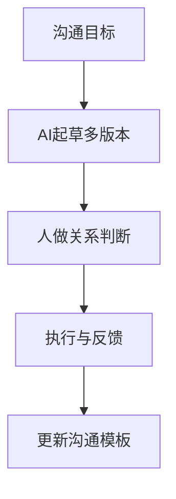

AI 在沟通里很强，但不是全能。  
它擅长“怎么说”，不负责“该不该说”。

## 沟通四层模型

1. 语言层（清晰表达）  
2. 结构层（信息排序）  
3. 关系层（对象理解）  
4. 后果层（行动承担）

AI 主要覆盖 1/2 层，3/4 层仍是人的责任。

```mermaid
flowchart TD
    A["沟通目标"] --> B["AI起草多版本"]
    B --> C["人做关系判断"]
    C --> D["执行与反馈"]
    D --> E["更新沟通模板"]
```

## 结论

把 AI 当“语言加速器”有效，  
把 AI 当“关系替代器”危险。

