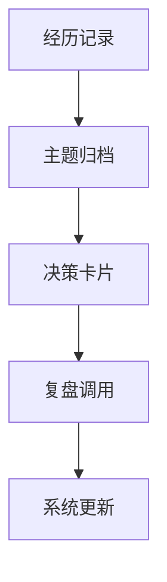

“记忆抢救”听起来像保存过去，  
其实更像在建设未来决策的基础设施。

## 外部大脑的最小结构

1. 时间线：知道事情何时发生。  
2. 主题索引：知道它属于什么问题。  
3. 决策卡片：知道它下次怎么用。

```mermaid
flowchart TD
    A["经历记录"] --> B["主题归档"]
    B --> C["决策卡片"]
    C --> D["复盘调用"]
    D --> E["系统更新"]
```

## 结论

外部大脑的价值，不在存储容量，  
而在关键时刻的调用速度与判断质量。

