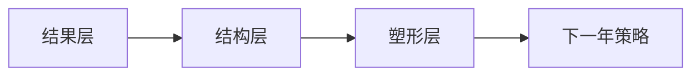

多数年度复盘失败，不是因为缺少反思，而是方法错了。  
把一年当成绩单，会得到“结果列表”；把一年当塑形过程，才能得到“下一年策略”。

## 年度复盘的三层模型

### 第一层：结果层（我做了什么）

项目、证书、变化、里程碑。  
这层必要，但信息价值最低。

### 第二层：结构层（我是怎么做到/错过的）

时间结构、注意力结构、协作结构。  
这层决定可复制性。

### 第三层：塑形层（这一年把我变成了什么人）

价值排序、风险偏好、决策风格。  
这层决定长期方向。

## 复盘框架图

## 可执行打分卡（10分制）

| 维度 | 评分问题 |
|---|---|
| 时间结构 | 我的高价值时间是否被长期保护？ |
| 注意力结构 | 输入是否服务核心问题，而非随机消耗？ |
| 决策质量 | 重大选择有无明确依据与复盘？ |
| 身体与节奏 | 身体状态是否支持长期执行？ |
| 关系与协作 | 关键关系是否提升效率与稳定性？ |

## 2023复盘的关键结论（方法化表达）

1. 不再把“忙”当作“有效”。  
2. 不再把“短期反馈”当作“长期价值”。  
3. 不再把“外部标准”当作“唯一方向”。

复盘的目的不是感慨过去，而是重写未来的默认设置。  
当你开始追踪“塑形变量”，年度复盘才真正有战略价值。

原始日记：<https://www.douban.com/note/859131537/>
