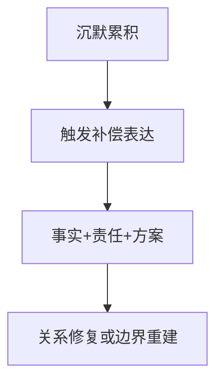

很多人把“晚了”理解成“无效”。  
但在关系里，表达有效性的核心不是时间点，而是结构质量。

## 迟来表达的三要素

1. 事实澄清：发生了什么。  
2. 责任承担：我应承担哪部分。  
3. 后续安排：以后如何避免重演。

## 结论

及时但空洞的道歉，常常不如迟到但完整的表达。  
关键是你是否愿意承担后续改变成本。

原始日记：<https://www.douban.com/note/847086193/>
