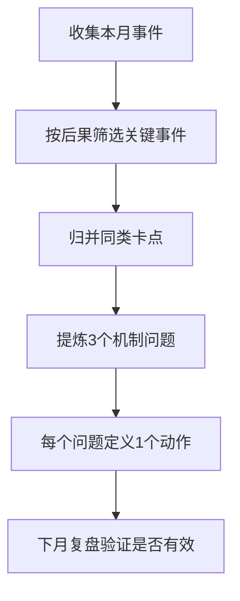

很多阶段复盘会失败，不是因为你不努力，而是因为你把“事件”当成了“问题”。

事件是一次性的，问题是可重复的。  
如果复盘停在事件层，下一次只会换个场景重演同样卡点。

## 为什么“三件事”比“十条流水账”更有效

因为真正影响一个阶段的通常不是 20 件事，而是 2-3 个反复出现的机制性矛盾：

1. 时间分配失衡（重要工作总被即时任务挤压）  
2. 能量管理失衡（高认知任务总在低状态时做）  
3. 决策机制失衡（总在临时情绪下决定长期事项）

当你抓住“机制”，才有可能把复盘转成系统修正。

## 一个可重复的三层复盘法

### 第一层：事件层（发生了什么）

先把本月关键事件列出来，但只保留“有后果”的事项。

### 第二层：机制层（为什么反复发生）

把事件归类后，追问“共同原因”而不是“个别借口”。

### 第三层：动作层（下个月如何改）

每个机制问题只配一个动作，不贪多。

## 复盘流程图

## 一张实用对照表

| 常见写法 | 问题 | 改写方式 |
|---|---|---|
| “这个月太忙了” | 结论空泛，无法行动 | “深度工作被会议切碎，周均不足6小时” |
| “效率很差” | 缺少机制解释 | “高难任务安排在晚间，认知峰值错位” |
| “下月加油” | 不可验证 | “每天9:30-11:00固定做最难任务” |

## 下个月只做这三件

1. 固定每周一次“机制复盘”，不是情绪复盘。  
2. 每个机制问题只允许一个改进行动。  
3. 用数据验证动作是否生效（时间、完成率、返工率）。

“三件事”的本质，不是简化生活，而是提高复盘信噪比。  
当你从事件回到机制，阶段才会真正改变。

原始日记：<https://www.douban.com/note/860032813/>
