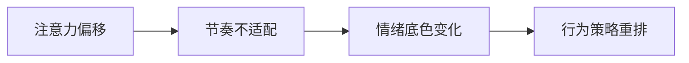

“空气变了”不是玄学，而是可观察指标变化。

## 三个可观测指标

1. 注意力：你反复关注的问题变了。  
2. 节奏：原先有效的节奏开始失灵。  
3. 情绪：情绪波动不再由单点事件驱动，而是由结构压力驱动。

```mermaid
flowchart LR
    A["注意力偏移"] --> B["节奏不适配"]
    B --> C["情绪底色变化"]
    C --> D["行为策略重排"]
```

## 应对建议

当你发现“空气先变”，先做三件事：  
减变量、稳作息、重新定义本月主线。

