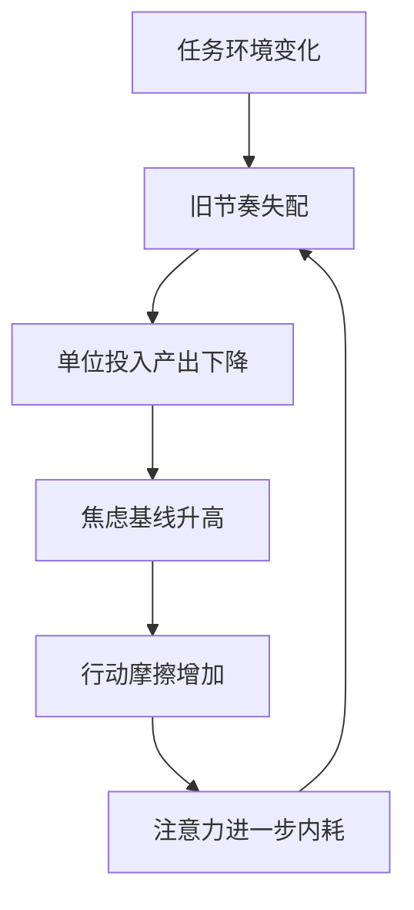
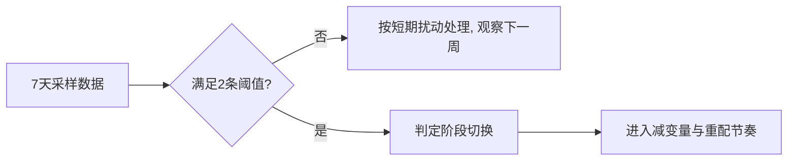

“空气变了”这句话听起来很主观，但它并不玄学。  
真正发生变化的，通常不是某个单点事件，而是你内部系统的参数在缓慢漂移: 注意力分布、节奏匹配度、情绪基线、行动摩擦。

如果只盯大事件，你会晚两到四周才意识到阶段变化。  
而阶段变化一旦被晚识别，后面就会以“失速、焦虑、返工”形式补课。

## 1. 先定义: 什么叫“空气变了”

在这篇里，我把它定义为:  
`同一套做事方法，在相似任务下，连续两周出现稳定失效。`

关键词有两个：

1. 连续性: 不是一天状态差，而是持续偏移。  
2. 稳定失效: 不是偶发波动，而是原来有效的方法开始普遍不灵。

## 2. 四个前置信号（比结果更早出现）

### 2.1 注意力主轴偏移

你反复想的问题从“怎么推进”变成“我是不是不行”。  
这不是情绪问题本身，而是系统从任务导向滑向自证焦虑。

### 2.2 节奏-任务错配

你仍在执行旧节奏，但任务复杂度已经变了。  
表现为：同样时长投入，产出密度显著下降。

### 2.3 情绪基线抬高

过去由单点事件触发的情绪，现在在无事件时也维持高位。  
这说明压力已经从“事件压力”转成“结构压力”。

### 2.4 行动摩擦上升

开始小事也拖、决策变慢、启动门槛升高。  
这往往是前面三项累积后的结果，不是“意志力不够”。

上图是一个慢性回路。可怕之处不在强度，而在它会自我强化。

## 3. 反例边界: 什么时候“空气变了”判断会失真

深度不只是“提出模型”，还要说明模型什么时候不成立。  
下面三种情况容易误判：

1. 短期生理因素扰动（睡眠债、轻微疾病）被误判为阶段变化。  
2. 单次外部冲击（项目突发）被误判为结构性趋势。  
3. 输入过载导致的短期噪声被误判为长期漂移。

所以判断标准必须加入“持续时间 + 多指标共振”，而不是单点感受。

## 4. 一个可验证的诊断框架（7天版）

每天记录四项，连续 7 天：

- `A` 注意力偏离度（0-10）  
- `R` 节奏适配度（0-10，越高越匹配）  
- `E` 情绪基线（0-10）  
- `F` 启动摩擦（0-10）

若满足以下任意两条，可判定“阶段已切换”：

1. `A>=7` 且持续 4 天以上；  
2. `R<=4` 且连续 3 天；  
3. `E+F` 均值较上周上升 >= 2 分。

## 5. 干预策略: 不是“更努力”，而是“重配系统”

当阶段切换被确认，优先顺序应是：

1. 减变量：砍掉非主线任务，降低并发。  
2. 重配节奏：把高认知任务前置到高能时段。  
3. 稳定底盘：先修睡眠和运动，再谈效率技巧。  
4. 缩短反馈：把周目标拆成 48 小时可验证里程碑。

这四步的核心是先恢复系统稳定性，再恢复产出强度。

## 6. 结构化周复盘模板（可直接复用）

| 模块 | 要回答的问题 | 产出 |
|---|---|---|
| 信号 | 哪两个指标持续恶化？ | 本周主风险 |
| 机制 | 失配发生在任务、节奏还是边界？ | 机制判断一句话 |
| 动作 | 下周只改哪一件事？ | 1 个可执行动作 |
| 验证 | 什么指标证明动作有效？ | 量化阈值 |

模板设计原则：每周只允许一个主动作，避免“策略通胀”。

## 7. 从“三月记事”到长期方法

“空气先变”这句话最有价值的地方，不是文艺表达，而是它提醒你：  
系统问题永远先于结果问题出现。

你越早在信号层面干预，代价越小；  
你越晚到结果层面才反应，修复成本越高。

## 结语

阶段变化并不可怕，可怕的是把它当成情绪问题处理。  
一旦你把它还原成“信号 -> 机制 -> 干预 -> 验证”的工程过程，就能把“我状态不对”变成“我知道怎么调系统”。
