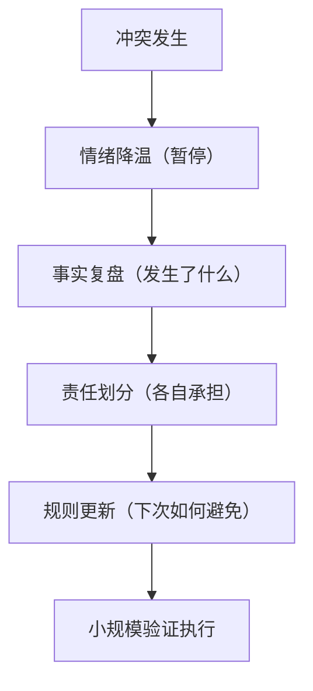

“什么是爱”这个问题，年轻时常用情绪回答，后来才知道它更接近一种长期治理问题。

情绪很重要，但情绪不是全部。  
关系能不能走远，取决于是否具备稳定结构。

## 关系结构的四个维度

1. 承诺维度：是否愿意承担现实责任，而不只停在表达。  
2. 边界维度：是否尊重差异，而不是控制对方。  
3. 成长维度：关系是否提升双方能力，而非相互拖耗。  
4. 复原维度：冲突后是否能修复，而非反复破坏。

## 关系健康度雷达（文字版）

| 维度 | 低分特征 | 高分特征 |
|---|---|---|
| 承诺 | 口头承诺多，行动兑现少 | 关键时刻稳定承担 |
| 边界 | 以爱之名越界 | 明确尊重彼此空间 |
| 成长 | 关系让人退化 | 关系促进成长 |
| 复原 | 冲突后冷战/逃避 | 能复盘并改进 |

## 冲突修复流程

## 从“感觉”到“判断”的转变

真正成熟的关系判断，不是“我还喜欢吗”，而是：

1. 我们是否能共同面对现实。  
2. 我们是否能在差异中合作。  
3. 这段关系是否让彼此变得更好。

爱当然有激情，但要走长远，必须落到结构。  
这也是重读这篇老日记后最清楚的体会。

原始日记：<https://www.douban.com/note/712169046/>
