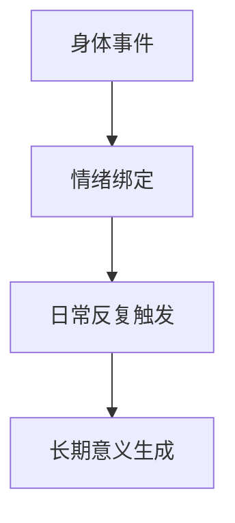

这篇最强的力量来自“具体”。  
不是宏大结论，而是一个身体细节把整段人生记忆串起来。

## 记忆锚点机制

1. 身体事件发生（疼痛/损伤/触感）。  
2. 与强情绪场景绑定。  
3. 在后续日常中被反复触发。  
4. 形成长期意义坐标。

## 写作启示

想写出有穿透力的文本，少用抽象形容词，多保留身体证据。

原始日记：<https://www.douban.com/note/872257054/>
