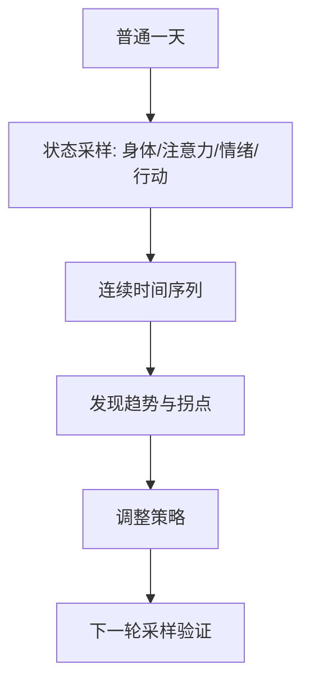
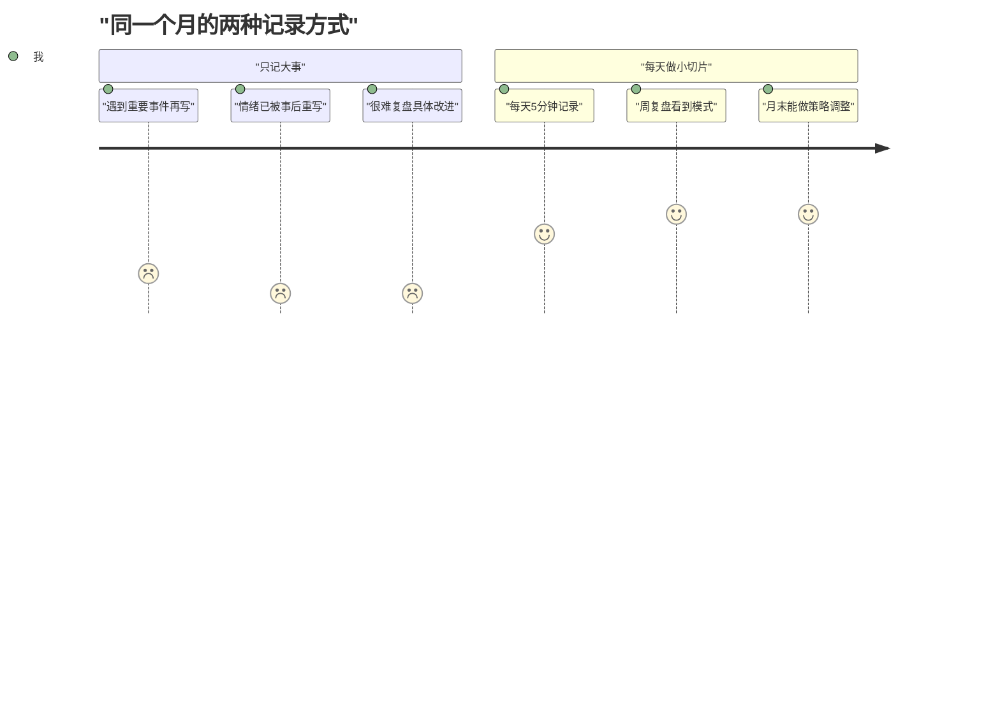
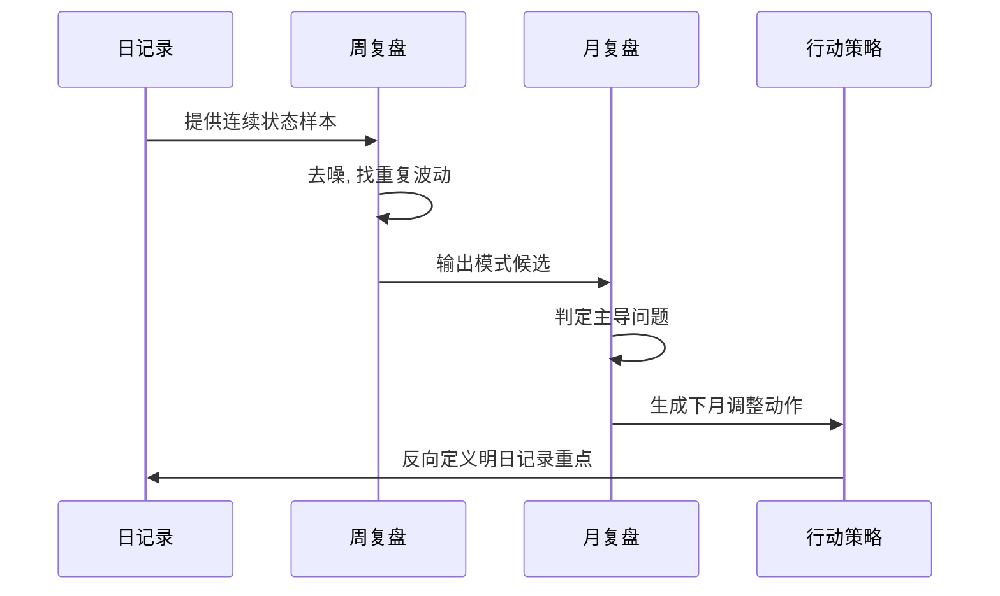
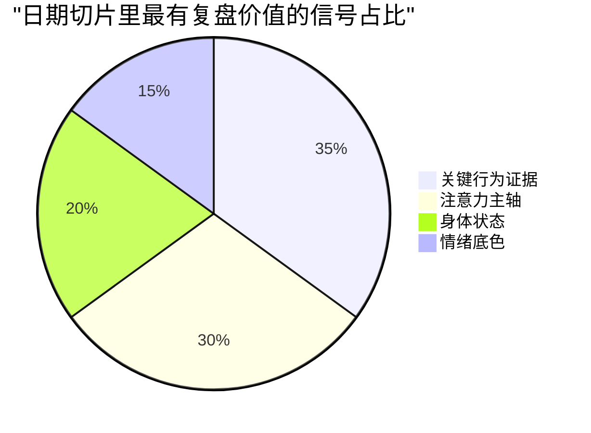

很多人低估了“普通日期”的价值。  
我们总觉得只有大事件值得写，结果多年后回看，真正能解释一个阶段变化的，往往是那些不起眼的日常切片。

这篇就回答一个问题：  
为什么像“6 月 16 日”这样的普通日期，反而可能是最有复盘价值的记录单位？

## 1. 日期写作的核心: 不是叙事，是采样

把日期写作当成“生活日志”容易写成流水账。  
把它当成“状态采样”，写作目标就会变得清晰: 记录能够跨时间比较的最小信息单元。

日期记录的价值，不在于文学性，而在于可比性。

## 2. 为什么“大事记”常常不够用

只记大事有三个天然缺陷：

1. 间隔太大，无法看到变化是“渐变”还是“突变”。  
2. 事后解释偏差大，容易把后来的理解覆盖当时真实状态。  
3. 可执行性弱，很难从“大判断”倒推出“明天怎么改”。

普通日期记录正好补这三个洞：它保留现场温度，也保留结构线索。

## 3. 一条高质量日期记录，至少要有四个字段

为了让记录可复盘、可比较，我现在建议固定四个字段：

| 字段 | 记录方式 | 作用 |
|---|---|---|
| 身体状态 | 睡眠/疲劳/疼痛/精力评分 | 判断执行波动是否来自生理底盘 |
| 注意力主轴 | 今天反复想的 1 个问题 | 识别阶段主线是否偏移 |
| 关键行为 | 当天最有效或最无效的一个动作 | 提取策略有效性证据 |
| 情绪底色 | 用 1 句话描述全天主情绪 | 区分事件情绪和结构情绪 |

这四项不是为了写得“完整”，而是为了后续能横向比较。

## 4. 从“日记”到“决策输入”的转化机制

日期记录真正的威力，不在当天，而在周/月复盘时的聚合分析。  
你会开始看到一些过去看不见的事实，比如：

- 低效率不总是能力问题，常常是睡眠和任务类型错配；
- 情绪波动不一定来自人际冲突，可能来自节奏长期失衡；
- 自认为“拖延”的阶段，实际上是在回避高不确定任务。

## 5. 一眼看出主问题: 信号权重图

下面这张图用于提醒：日期记录里，最该重视的是“可干预信号”，不是“好不好看”。

## 6. 一个可直接用的“日期切片模板”

每天不需要写长文，5 分钟足够：

1. 身体状态（0-10）+ 一句话原因。  
2. 今天最耗我注意力的问题是什么。  
3. 今天最有效/最无效的一个动作。  
4. 明天只保留一个改动动作。

这个模板有个关键设计：  
它强制你从“描述一天”转向“干预系统”。

## 7. 一张打分卡: 让记录质量可度量

你可以按周给自己的记录打分，避免写着写着又回到流水账。

| 评分项 | 0分 | 1分 | 2分 |
|---|---|---|---|
| 具体性 | 只有感受词 | 有事件描述 | 有状态+行为证据 |
| 可比性 | 每天格式不同 | 部分字段一致 | 四字段固定可横比 |
| 可行动性 | 无改进行动 | 行动模糊 | 行动可在明天执行 |
| 可验证性 | 无复盘节点 | 仅月末回看 | 周/月双复盘闭环 |

每周总分满分 8 分，低于 5 分说明记录系统正在退化。

## 8. 常见误区

1. 写成纯情绪宣泄，没有行为证据。  
2. 写成事项清单，没有状态上下文。  
3. 每天格式都变，导致后续无法比较。  

如果一个记录不能拿来和上周比，它就很难成为长期资产。

## 结语

“六月十六日”这类看起来普通的标题，真正珍贵之处在于：  
它保存了一个时间切片里的真实信号，而真实信号是任何长期复盘系统最稀缺的资源。

日期写作不是流水账。  
它是你给未来自己留下的低成本、高复用决策数据。
