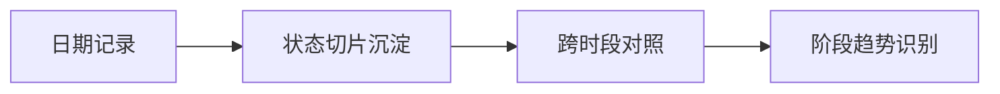

普通日期的记录看似平淡，  
但它提供了最难伪造的信息：当时真实状态。

## 日期写作的高价值字段

1. 当天身体状态。  
2. 当天注意力主轴。  
3. 当天最在意的一件小事。

```mermaid
flowchart LR
    A["日期记录"] --> B["状态切片沉淀"]
    B --> C["跨时段对照"]
    C --> D["阶段趋势识别"]
```

## 结论

日期写作不是流水账，而是未来复盘的数据源。  
越具体，越有长期价值。

原始日记：<https://www.douban.com/note/863327395/>
