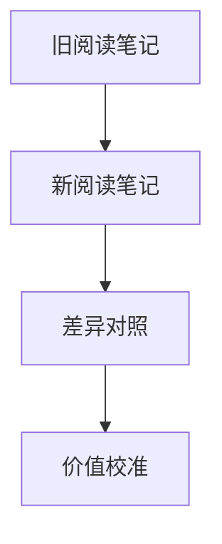

重读不是重复输入，而是自我校准。  
书像参照物，人在变化。

## 重读框架

1. 旧阅读：我当时被什么打动。  
2. 新阅读：我现在在意什么。  
3. 差异解释：是处境变化还是价值变化。

```mermaid
flowchart TD
    A["旧阅读笔记"] --> B["新阅读笔记"]
    B --> C["差异对照"]
    C --> D["价值校准"]
```

## 一句话结论

好书不是给你答案，而是给你一面“长期对照镜”。

