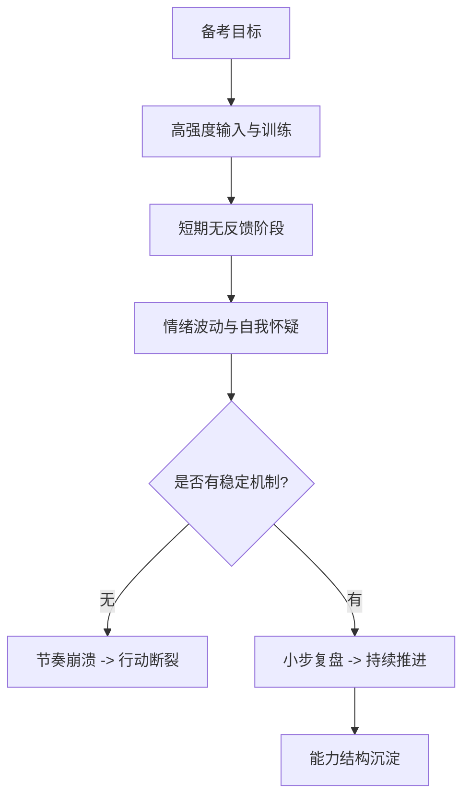
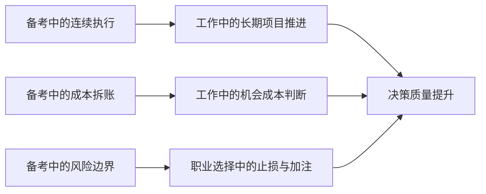

公考叙事里最常见的一句话是“上岸了没”。  
但如果只看结果，很多真实变化会被掩盖掉: 一段高压训练真正留下的，不只是成绩，而是一个人处理不确定性的方式。

这篇不写励志，也不写鸡汤，我只复盘三件更实在的事：

1. 我是怎么在长期不确定里维持执行的。  
2. 我对“成本”这件事是怎么被迫学会精算的。  
3. 这段经历后来怎样迁移到了工作与生活决策里。

## 先把问题说透: 公考不是考试问题，是系统问题

公考准备期通常同时叠加四种压力：

- 时间压力：周期长，回报延迟；
- 比较压力：信息流里永远有人“更快更好”；
- 机会成本压力：你在这条路上投入的每一天，都意味着放弃其他路径；
- 身份压力：短期结果会被外界过度解释为“能力标签”。

所以它本质上不是一次知识测验，而是一次“系统稳定性”测验。

## 我真正获得的，不是“上岸概率”，而是三种底层能力

## 1) 高压执行: 先保连续，再谈强度

备考初期我犯过一个典型错误: 一上来就追“高强度满负荷”，结果几天后就断档。  
后来我改成了一个更朴素的策略: 先保证每天不断，再逐步提高强度。

这背后的逻辑是：  
在长周期任务里，`连续性 > 峰值强度`。  
一次超常发挥不值钱，能否持续 60-90 天才决定结果。

## 2) 成本意识: 每个选择都有显性和隐性账单

公考阶段逼着我学会了“成本拆账”：

- 显性成本：时间、金钱、精力；
- 隐性成本：错过的机会、情绪耗损、关系张力；
- 延迟成本：短期看不到，长期会集中结算。

当你开始这样看问题，就不会再把“坚持”浪漫化，而会把它当成可计算、可管理的决策。

## 3) 风险边界: 知道自己能扛什么，才能选对战场

很多人说“拼一把”，但没定义“能拼到什么程度”。  
我后来给自己补了这个定义: 可承受风险边界。

简单说就是两条线：

- 底线：我绝不牺牲的部分（健康、基本生活秩序）；
- 上限：我可以阶段性承受的压力幅度（强度、时长、不确定期）。

这比“盲目激励”有用得多，因为它能直接指导你在关键节点该收还是该压。

## 一张迁移图: 这套能力后来怎么用在工作里

## 一个可复用的“公考后能力提炼模板”

如果你也经历过类似阶段，这个模板可以直接拿去复盘：

| 复盘维度 | 关键问题 | 产出形式 |
|---|---|---|
| 执行机制 | 我如何在低反馈期保持连续？ | 每周节奏清单 |
| 成本结构 | 我忽略了哪些隐性成本？ | 成本账单表 |
| 风险边界 | 哪些压力是可承受/不可承受？ | 个人边界声明 |
| 迁移场景 | 这套能力能迁移到哪里？ | 3个现实应用点 |

重点不是“总结感受”，而是把经历转成以后能重复使用的方法。

## 最容易踩的坑

1. 把阶段结果等同于自我价值。  
2. 只记得痛苦，不提炼机制。  
3. 复盘停在情绪，不落到动作。  

这三个坑的共同后果是：经历很重，但沉淀很少。

## 结语

“我的公考故事”真正重要的部分，不是我在某次考试里拿了什么结果，  
而是它让我学会了三件长期有效的事：在不确定里持续行动、为选择算清成本、给风险设定边界。

结果会过去，能力结构会留下。  
而能力结构，才是你下一次面对复杂选择时真正能带走的东西。
