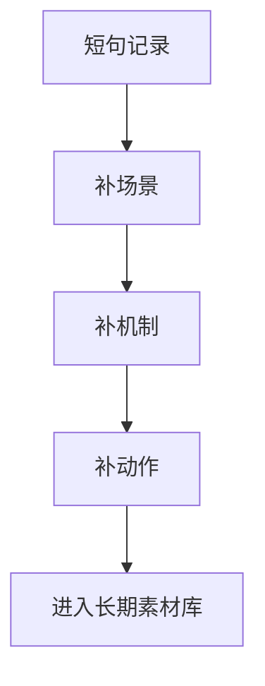

很多人低估“有感”类短记录。  
其实它们是高价值的一手认知样本。

## 短句升级法

1. 场景补全：这句话在什么情况下出现。  
2. 机制补全：它在说明什么重复问题。  
3. 动作补全：下一次遇到时怎么处理。

```mermaid
flowchart TD
    A["短句记录"] --> B["补场景"]
    B --> C["补机制"]
    C --> D["补动作"]
    D --> E["进入长期素材库"]
```

## 结论

不要把短句当半成品。  
它是高密度线索，只是需要二次加工。

原始日记：<https://www.douban.com/note/711302061/>
