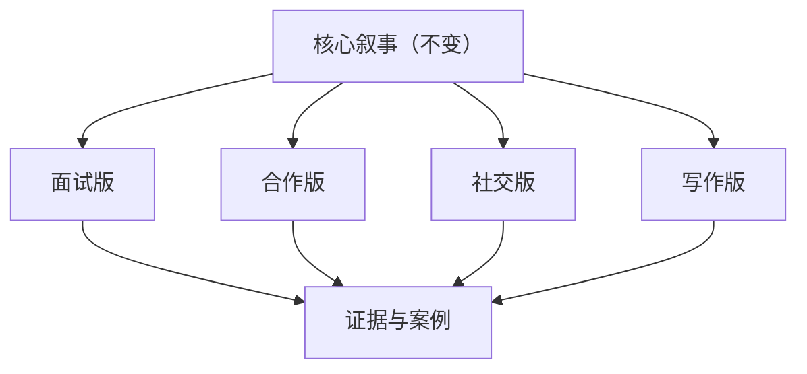

同一个人需要多个“自我介绍”版本，这不是虚伪，而是专业表达能力。

问题不在“有多少版本”，而在“版本之间是否保持同一内核”。  
如果每个场景都换一套人设，信任会迅速崩塌。

## 自我介绍的三层结构

### 核心层（不变）

你是谁、你长期在解决什么问题、你的价值偏好是什么。

### 场景层（可变）

面试强调结果，合作强调边界，社交强调温度，写作强调观点。

### 证据层（必须）

每个版本都要有可验证证据（项目、经历、成果、方法）。

## 结构示意图

## 常见失败与修正

| 失败模式 | 表现 | 修正方式 |
|---|---|---|
| 只讲标签 | “我很努力/我很热爱” | 换成“我解决了什么问题” |
| 只讲经历 | 时间线很长但无重点 | 聚焦3个代表性案例 |
| 过度迎合 | 每次自述差异过大 | 固定核心叙事模板 |

## 一个可直接套用的模板

1. 我长期关注的主题是 `X`。  
2. 我在 `Y` 场景里做过 `Z`，结果是 `R`。  
3. 我的方法是 `M`，下一步想在 `N` 方向继续。

这套模板的价值在于：  
无论在哪个场景，你都在说同一个人，只是换了光照角度。

原始日记：<https://www.douban.com/note/847085174/>
