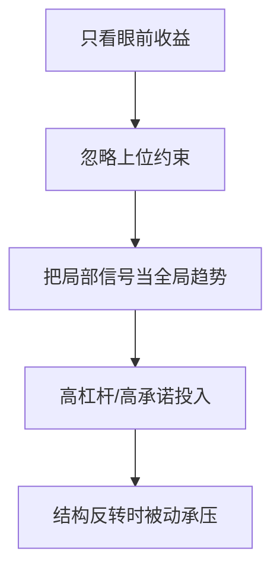

“螳螂捕蝉，黄雀在后”的现代意义，不只是劝人谨慎，而是提示一个更深的判断原则：  
**任何局部最优，都可能是更高层博弈里的诱饵。**

## 风险判断中的“位置感”

位置感不是地理位置，而是你在系统中的角色位置：

1. 信息位置：你知道的是全局还是局部。  
2. 权力位置：你能决定规则，还是只能响应规则。  
3. 时间位置：你在做短期套利，还是长期配置。

如果位置判断错了，再聪明的策略也可能南辕北辙。

## 经典误判链条

## 三个实战提问（决策前）

1. 这件事里，谁是规则制定者？  
2. 这轮收益依赖的是能力，还是时点红利？  
3. 如果外部条件反转，我的退出路径是什么？

## 一个简化评估表

| 维度 | 低风险信号 | 高风险信号 |
|---|---|---|
| 信息 | 多源交叉验证 | 只靠单一叙事 |
| 结构 | 约束条件清晰 | 规则边界模糊 |
| 流动性 | 有退出方案 | 退出严重依赖他人 |

这篇日记最有价值的地方，是把一个成语从道德劝诫变成了结构分析。  
真正成熟的判断，不是“敢不敢做”，而是“先看清自己在哪一层”。

原始日记：<https://www.douban.com/note/870226065/>
