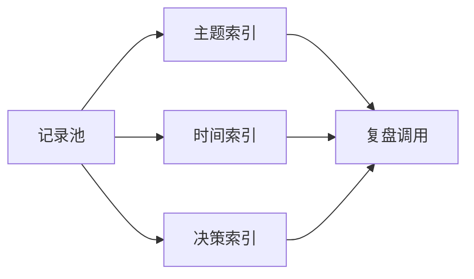

第二篇“记忆抢救”比第一篇更关键：  
它把问题从“写下来”推进到“找得到、用得上”。

## 索引系统最小方案

1. 主题索引（问题维度）。  
2. 时间索引（演化维度）。  
3. 决策索引（行动维度）。

## 结论

只有当经验可被快速调用，它才算真正属于你。  
否则只是信息存档，不是认知资产。

原始日记：<https://www.douban.com/note/824158228/>
