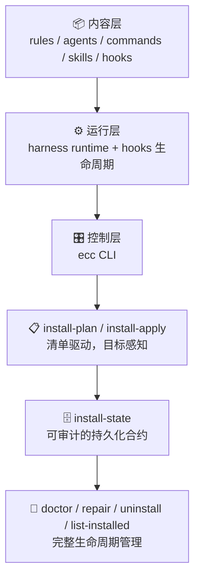

> **核心问题：** 你是在"与 AI 一起 Vibe"，还是在"工程化地驾驭 Agent"？这两者之间的差距，就是这篇文章要填补的。

---

## 一、先把坐标定清楚：Vibe Coding vs Agentic Engineering

**Vibe Coding** 这个词由 Andrej Karpathy 在 2025 年 2 月提出：你只需描述意图，让 LLM 写代码，自己基本不看细节。对于原型、个人脚本和快速实验，这非常有效。

但当你把这套方式用到生产场景时，会撞上四面高墙：

| 问题 | 具体表现 |
|---|---|
| **上下文预算** | MCP、长对话、历史状态挤占有效 token，200k 窗口实际只剩 \~70k |
| **跨会话记忆** | 每次新对话，之前建立的所有约束和策略消失 |
| **质量稳定性** | 一次做对不难，持续做对极难，pass@1 和 pass^3 差距悬殊 |
| **多实例协作** | 并行 Claude 会话太容易产生冲突和相互污染 |

**Agentic Engineering** 是下一个阶段：把 AI 的使用从"直觉提示"转变为"可计划、可审计、可回滚的工程系统"。

[`everything-claude-code`](https://github.com/affaan-m/everything-claude-code)（简称 ECC）就是这个转变的最佳开源实践之一。它赢得了 Anthropic Hackathon，目前已有 **50K+ stars、6K+ forks、30 位贡献者**，并在 10+ 个月真实产品开发中演化而来。

---

## 二、ECC 是什么：不是配置包，是 Agent Harness 控制平面

大多数人第一次看到 ECC，会以为它是"一堆 CLAUDE.md 配置"。这个认知是错的。

从 **v1.8 开始**，ECC 明确将自己定位为 **"Agent Harness Performance Optimization System"**——中文可以理解为"Agent 容器性能优化系统"或者"Agent 控制平面"。

它包含两个清晰的层：



**控制平面的关键属性：可计划、可审计、可修复、可卸载。**

这四个词区分了"配置合集"和"工程系统"的本质差异。

---

## 三、四个核心概念：从入门到理解

### 3.1 Rules（规则层）

Rules 是 Agent 的"行为基线"，等同于一个永远在线的守则。ECC 把规则组织成：

```
rules/
  common/        # 语言无关的通用原则（始终安装）
  typescript/    # TypeScript/JavaScript 特定模式
  python/        # Python 特定模式
  golang/        # Go 特定模式
  java/          # Java（v1.9 新增）
  kotlin/        # Kotlin/Android（v1.9 新增）
  swift/         # iOS 开发
  rust/          # 系统级编程
  php/           # Web 后端
  cpp/           # C++（v1.9 新增）
```

**ECC v1.9 已支持 12 种语言生态**，common 规则涵盖你希望 AI 始终遵守的工程原则，语言规则处理具体工具链和模式。

### 3.2 Skills（技能层）

Skills 是"可复用的工作流 playbook"，用 Markdown 格式的 `SKILL.md` 定义，通过 YAML frontmatter 声明名称、触发条件和工具集：

```markdown
---
name: tdd-workflow
description: Test-driven development cycle
triggers: [test, TDD, unit test]
---

# TDD 工作流
1. 先定义接口
2. 写失败测试 (RED)
3. 最小实现使测试通过 (GREEN)
4. 重构优化 (IMPROVE)
5. 验证 80%+ 覆盖率
```

Skills 可显式调用（`/skill-name`），也可由 Agent 基于触发词自动加载。**v1.9 新增的 Skills 包括：**

- `pytorch-patterns`：深度学习工作流
- `documentation-lookup`：API 文档检索
- `bun-runtime` / `nextjs-turbopack`：现代 JS 工具链
- `mcp-server-patterns`：MCP 服务器配置模式
- `strategic-compact`：上下文压缩决策指南

### 3.3 Agents（子智能体层）

Agents 是"有限作用域的委托执行者"。每个 Agent 定义了专属的工具集、模型选择和系统提示：

```markdown
---
name: code-reviewer
description: 审查代码质量、安全性和可维护性
tools: [Read, Grep, Glob, Bash]
model: opus
---

你是一位资深代码审查者，专注于...
```

**ECC 的 Agent 分工路线图：**

| 场景 | 推荐 Agent |
|---|---|
| 功能开发 | `planner` → `tdd-guide` → `build-error-resolver` |
| 代码审查 | `code-reviewer` (Opus) |
| 安全检查 | `security-auditor` |
| 调试复杂 Bug | `build-error-resolver` + Opus |
| 新项目启动 | `Scaffolding Agent` + `Deep Research Agent` 双实例 |

**v1.9 新增了 6 个语言专属 Agent**：`typescript-reviewer`、`pytorch-build-resolver`、`java-reviewer`、`kotlin-reviewer` 等。

### 3.4 Hooks（生命周期钩子）

Hooks 是 ECC 最有深度的机制，在特定事件节点触发脚本或命令：

```json
{
  "matcher": "tool == \"Edit\" && tool_input.file_path matches \"\\.(ts|tsx)$\"",
  "hooks": [{
    "type": "command",
    "command": "#!/bin/bash\ngrep -n 'console\\.log' \"$file_path\" && echo '[Hook] 发现 console.log，请在提交前清理' >&2"
  }]
}
```

**v1.8/v1.9 的 Hooks 重大升级：**

- `SessionStart` Hook：新会话开始时自动加载上次记忆
- `Stop` Hook（会话结束）：自动保存学习成果和进度摘要
- `PreCompact` Hook：在上下文压缩前保存关键状态
- **运行时控制**：`ECC_HOOK_PROFILE=minimal|standard|strict` 无需修改文件即可调整行为
- **禁用指定 Hook**：`ECC_DISABLED_HOOKS=hook-name` 环境变量控制

---

## 四、四大生态工具：超越配置的能力扩展

ECC 不只是配置文件，它还附带了四个独立的工具系统。

### 4.1 AgentShield — 安全审计器

AgentShield 诞生于 Anthropic x Cerebral Valley Hackathon（2026 年 2 月），**1282 个测试、98% 覆盖率、102 条静态分析规则**。

```bash
# 快速扫描（无需安装）
npx ecc-agentshield scan

# 自动修复安全问题
npx ecc-agentshield scan --fix

# 终极武器：三 Opus Agent 红队/蓝队/审计管线
npx ecc-agentshield scan --opus --stream

# 从零生成安全配置
npx ecc-agentshield init
```

`--opus` 模式会启动三个 Claude Opus 4.6 Agent 协同工作：攻击者寻找漏洞链，防守者评估保护，审计者综合双方给出优先级列表。这是真正的"对抗性推理"，不是规则匹配。

**扫描范围**：CLAUDE.md、settings.json、MCP 配置、hooks、agent 定义、skills——涵盖 secrets 检测（14 种模式）、权限审计、hook 注入分析、MCP 风险画像等。

输出报告支持终端（A-F 色阶评级）、JSON（CI 集成）、Markdown、HTML。发现严重问题时 exit code 为 2，可直接用作构建门控。

### 4.2 Plankton — 写时代码质量执法

Plankton 通过 `PostToolUse` Hook 在每次文件编辑后自动运行，三阶段架构：

1. **静默格式化**：自动修复 40-50% 的问题
2. **结构化收集**：剩余违规聚合为 JSON
3. **子进程委托**：按违规复杂度路由到 Haiku/Sonnet/Opus 修复

支持 Python、TypeScript、Shell、YAML、JSON、TOML、Markdown 和 Dockerfile。它还包含**配置保护钩子**，防止 Agent 通过修改 linter 配置来逃避代码质量检查。

### 4.3 Continuous Learning v2 — 持续学习系统

这是 ECC 中最接近"AI 自我进化"的功能。

**工作原理**：当 Claude Code 发现一个非平凡的调试技巧、项目特定模式或值得记录的信息时，Stop Hook 在会话结束时将其保存为新的"instinct"（本能）。下次遇到类似问题，对应的技能自动加载。

```bash
/instinct-status   # 查看已学本能及置信度
/instinct-import <file>  # 从他人处导入本能
/instinct-export         # 导出供团队分享
/evolve              # 将相关本能聚合为技能
```

**为什么用 Stop Hook 而非 UserPromptSubmit？** 后者在每条消息上都触发，增加全程延迟；前者只在会话结束时运行一次，不影响使用体验。

### 4.4 Skill Creator — 从你的代码库提炼技能

Skill Creator 分析你的 Git 历史，自动提炼出项目特定的 SKILL.md 文件。

```bash
/skill-create          # 分析当前仓库
/skill-create --instincts  # 同时生成持续学习 instincts
```

这意味着 ECC 可以从你自己的工程决策中"学习"，而不只是依赖通用最佳实践。

---

## 五、跨平台支持：四大 AI 编码工具一套系统

**ECC v1.7 开始系统性支持四个 AI 编码工具**，这是它的核心架构创新之一：

| 平台 | 安装方式 | Hooks | Skills | 备注 |
|---|---|---|---|---|
| **Claude Code** | Plugin 或 Manual | ✅ 完整支持 | ✅ SKILL.md | 原生平台，功能最完整 |
| **Cursor IDE** | DRY 适配器模式 | ✅ 复用 Claude Code scripts | ✅ | 无需重复维护 |
| **OpenCode** | Plugin 系统 | ✅ 通过插件 | ✅ | 31+ 命令 |
| **Codex (App/CLI)** | AGENTS.md | ❌ 无 Hook 支持 | ✅ | 通过 AGENTS.md 补偿 |

**架构秘诀**：`AGENTS.md` 放在根目录是"万能跨工具文件"，四个工具都能读取。Cursor 通过 DRY 适配器模式复用 Claude Code 的 hook 脚本，无需维护两套逻辑。

---

## 六、安装系统拆解：v1.9 的清单驱动架构

这是 ECC 从"文档仓库"升级为"控制平面"的关键所在。

### 6.1 三步走：规划 → 执行 → 诊断

```bash
# 第一步：查看支持的安装画像（不改任何文件）
node scripts/install-plan.js --list-profiles --json
```

返回 5 个 profile：`core / developer / security / research / full`

```bash
# 第二步：生成目标平台的安装计划（只做规划）
node scripts/install-plan.js --profile developer --target codex --json
```

在 `developer + codex` 组合下：请求 9 个模块，实际选中 4 个（agents-core、platform-configs、database、workflow-quality），跳过不兼容的 5 个。**这不是全量盲拷贝，是目标感知的选择性安装。**

```bash
# 第三步：执行安装前先 dry-run 预览
node scripts/install-apply.js --profile developer --target codex --dry-run

# 确认无误后真正执行
node scripts/install-apply.js --profile developer --target codex
```

### 6.2 统一入口 CLI

如果你用统一入口：

```bash
node scripts/ecc.js --help
```

会看到完整的控制面命令：

```
install     安装 ECC 组件
plan        生成安装计划
doctor      诊断安装状态
repair      修复异常组件
uninstall   完整卸载
sessions    会话管理
list-installed  查看已安装组件
```

安装状态持久化在 `ecc-install-state.json`（路径随平台变化），这也是它能支持"可计划、可审计、可修复、可卸载"的技术基础。

---

## 七、Token 经济学：降本不降质的系统方法

AI 编程成本高的根本原因不是模型贵，而是架构设计没有对 token 敏感。ECC 的长文指南在这里提供了非常实用的框架。

### 7.1 模型路由策略

| 任务类型 | 推荐模型 | 原因 |
|---|---|---|
| 文件探索/搜索 | **Haiku** | 快速且足够 |
| 简单单文件修改 | **Haiku** | 指令清晰，无需重型模型 |
| 多文件实现 | **Sonnet** | 编程任务的最佳性价比 |
| 复杂架构设计 | **Opus** | 需要深度推理 |
| PR 代码审查 | **Sonnet** | 理解上下文，捕捉细节 |
| 安全分析 | **Opus** | 不能有遗漏 |
| 文档写作 | **Haiku** | 结构简单，无需重型模型 |
| 调试复杂 Bug | **Opus** | 需要在脑中维持整个系统状态 |

**黄金法则：90% 的编程任务用 Sonnet。当第一次尝试失败、任务跨越 5+ 文件、或涉及安全关键代码时，升级到 Opus。**

### 7.2 上下文窗口管理

```json
// ~/.claude/settings.json
{
  "model": "sonnet",
  "env": {
    "MAX_THINKING_TOKENS": "10000",
    "CLAUDE_AUTOCOMPACT_PCT_OVERRIDE": "50"
  }
}
```

**MCP 的 token 陷阱**：每个 MCP 工具描述都消耗 token。启用 10 个 MCP，你的 200k 窗口可能只剩 \~70k。建议：每个项目最多 10 个 MCP，最多 80 个活跃工具。

**战略性压缩时机**（`/compact` 的正确使用）：

✅ 研究/探索完成，准备进入实现  
✅ 完成一个里程碑，准备开始下一个  
✅ 调试结束，继续功能开发  
❌ **永远不要在实现中途压缩**（会丢失变量名、文件路径、中间状态）

### 7.3 跨会话记忆模式

```bash
# CLI 动态注入上下文（比 CLAUDE.md 更灵活）
claude --system-prompt "$(cat memory.md)"

# 按场景切换上下文别名
alias claude-dev='claude --system-prompt "$(cat ~/.claude/contexts/dev.md)"'
alias claude-review='claude --system-prompt "$(cat ~/.claude/contexts/review.md)"'
alias claude-research='claude --system-prompt "$(cat ~/.claude/contexts/research.md)"'
```

这种模式比把所有内容放入 CLAUDE.md 更"外科精准"——系统提示的优先级高于用户消息，高于工具结果。

---

## 八、并行化与子 Agent 架构

### 8.1 Git Worktree 并行模式

```bash
# 创建独立工作树，每个运行独立 Claude 实例
git worktree add ../project-feature-a feature-a
git worktree add ../project-feature-b feature-b
git worktree add ../project-refactor refactor-branch

cd ../project-feature-a && claude
```

**关键原则：始终明确定义每个实例的作用域，目标是最小可行并行度，而非"开越多实例越好"。**

### 8.2 "瀑布级联"管理法

当运行多个 Claude Code 实例时：

- 新任务在右侧新标签页打开
- 从左到右扫视，最老到最新
- 同时专注的任务最多 3-4 个
- 用 `/rename <name>` 命名，用 `/fork` 分叉

### 8.3 阶段化 Agent 编排

```markdown
Phase 1: RESEARCH  → Explore Agent → research-summary.md
Phase 2: PLAN      → Planner Agent → plan.md
Phase 3: IMPLEMENT → TDD Agent     → 代码变更
Phase 4: REVIEW    → Reviewer Agent → review-comments.md
Phase 5: VERIFY    → Build Resolver（如需）→ 完成或循环
```

每个 Agent 进一个清晰的输入，产出一个清晰的输出。阶段之间用 `/clear` 清洁上下文。

### 8.4 子 Agent 的"目的传递问题"

子 Agent 的常见陷阱：它知道查询词，但不知道查询背后的"目的"。

**解决方案：迭代检索模式**
1. 编排 Agent 评估每个子 Agent 的返回
2. 在接受前追问补充问题
3. 子 Agent 回到信息源获取答案后返回
4. 循环至满意（最多 3 轮）

---

## 九、评测框架：pass@k vs pass^k

ECC 长文指南提供了一个非常实用的评测框架，值得每个做 Agentic Engineering 的人理解：

```
pass@k：k 次尝试中至少 1 次成功
  k=1: 70%  |  k=3: 91%  |  k=5: 97%

pass^k：k 次尝试全部成功
  k=1: 70%  |  k=3: 34%  |  k=5: 17%
```

**当你"只需要能用"时，用 pass@k。当你需要"每次都对"时，用 pass^k。**

生产场景的苦难就在于：你以为在衡量 pass@k，实际上你需要的是 pass^k，而两者之间差距巨大。

**验证循环模式**：

- **检查点验证**：设定明确检查点，对照预定义标准验证，失败则修复再推进
- **持续验证**：每隔 N 分钟或重大变更后，自动运行完整测试套件 + lint

---

## 十、给不同角色的落地路径

### 个人开发者（最小可行路径）

1. **不要**直接 `full` 安装，先用 `plan` 了解模块
2. 从 `core` 或 `developer` profile 开始，按痛点增量加模块
3. 把 `doctor / repair / uninstall` 路径先跑通
4. 每周回顾：哪些 Skills 命中率高？哪些 Hooks 只在制造噪音？

```bash
# 推荐入门序列
node scripts/install-plan.js --list-profiles
node scripts/install-plan.js --profile developer --target claude-code --json
node scripts/install-apply.js --profile developer --target claude-code --dry-run
node scripts/install-apply.js --profile developer --target claude-code
node scripts/ecc.js doctor
```

### 团队工程师（协作落地路径）

1. **CLAUDE.md vs AGENTS.md 分工**：用 AGENTS.md 放共享指令，CLAUDE.md 放 Claude 专属补充
2. AgentShield 接入 CI，发现关键风险时阻断构建
3. 用 Skill Creator 从团队 Git 历史提炼项目专属 skills
4. Continuous Learning v2 的 instincts 定期导出共享给全团队

### Vibe Coding 入门者（学习路径）

如果你刚开始探索 AI 辅助编程，ECC 可以作为极好的"工程师视角"学习材料：

1. 先读 `rules/common/` 理解通用工程原则
2. 看 `agents/` 目录理解什么叫"作用域受限的 AI"
3. 研究 `hooks/memory-persistence/` 体验跨会话记忆的实现思路
4. 用 AgentShield 扫一次自己的 Claude 配置

---

## 十一、优势与边界的诚实评估

### 真正有价值的地方

1. **把 Agent 使用经验产品化**：经验沉淀变成可安装的结构，而非口耳相传
2. **Selective Install + Install State**：运维和回滚有据可依，不是"装了不知道装了什么"
3. **跨 Harness 统一思路**：Claude Code、Cursor、Codex、OpenCode 一套逻辑降低迁移成本
4. **测试覆盖完整**：1566 个测试（v1.9），减少"改一处崩一片"的概率
5. **Adversarial Security**：AgentShield 的红队/蓝队模式是市面上最系统的 Agent 安全方案之一

### 需要注意的边界

1. **默认能力面很大**，上手容易"过配"——一定要先 `plan` 再 `install`
2. **Hooks 和自动化链路较多**，团队推广需要接受一定流程约束
3. **这不是"装完就变强"**，仍需项目级裁剪和评测闭环
4. **长文中的部分性能收益**（如 mgrep token 降低）属于经验结论，最好在自己项目上做 A/B 二次验证

---

## 结语：这套系统教会我的一件事

ECC 最值得学的，不是它包含多少个 Skill 或命令。

真正值得学的是背后的**工程哲学**：

> 把 AI 编程从"提示词玄学"转变为"可计划、可评测、可回滚、可演进的工程系统"。

Vibe Coding 让你快速开始。Agentic Engineering 让你持续交付。ECC 是这条路上最好的参考实现之一。

---

**延伸阅读**

- [everything-claude-code 仓库](https://github.com/affaan-m/everything-claude-code)
- [The Longform Guide](https://github.com/affaan-m/everything-claude-code/blob/main/the-longform-guide.md)（必读）
- [AgentShield 安全审计](https://github.com/affaan-m/agentshield)
- [Anthropic Claude Code 官方文档](https://docs.anthropic.com/claude/docs/claude-code)
- [AGENTS.md 规范说明](https://aihero.dev/agents-md)
