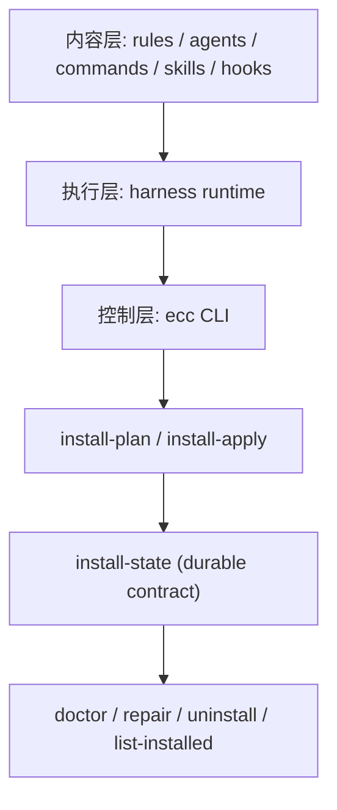

这篇不是“工具安利”，而是一次工程视角的拆解。

我把仓库 [`affaan-m/everything-claude-code`](https://github.com/affaan-m/everything-claude-code) 拉到本地后，做了三件事：

1. 读入口文档与核心脚本（`README.md`、`the-longform-guide.md`、`scripts/ecc.js`、`scripts/install-plan.js`）。  
2. 跑关键 CLI 路径（`ecc`、`install-plan`、`doctor`）。  
3. 跑完整测试集，拿可复现结果（`1566 / 1566` 通过）。

目标是回答一个问题：  
**ECC 的本质到底是“配置合集”，还是“面向 AI Agent 的控制平面”？**

## 一、背景：为什么会出现 ECC 这种项目

大多数人对 AI 编程助手的理解还停留在 Prompt 层：  
“给它更好的提示词，它就更强。”

但生产级使用很快会遇到四类系统问题：

1. 上下文预算问题：MCP、长对话、历史状态挤占有效 token。  
2. 记忆持续性问题：跨会话后，策略和约束丢失。  
3. 质量稳定性问题：一次做对不难，持续做对很难。  
4. 多实例协作问题：并行会话和多分支开发很容易相互污染。

ECC 的设计思路不是继续加“神提示词”，而是把这些问题结构化到可执行层：  
**rules + agents + commands + hooks + skills + install state + lifecycle CLI。**

## 二、原理：两层架构，而不是一堆散文件

从仓库结构看，ECC 可以抽象成两层：



### 2.1 内容层（你“装什么”）

- `rules/`：语言与通用规则（TS/Python/Go/Rust 等）。  
- `agents/`：任务角色拆分（reviewer、planner、resolver 等）。  
- `commands/`：可复用工作流入口。  
- `skills/`：高频任务知识包。  
- `hooks/`：会话开始/结束、工具调用前后治理。

这一层决定“能力表面”。

### 2.2 控制层（你“怎么装、怎么管、怎么修”）

ECC v1.9 把安装从脚本复制升级为“清单驱动 + 状态驱动”：

- 清单：`manifests/install-*.json`  
- 计划：`scripts/install-plan.js`  
- 执行：`scripts/install-apply.js`  
- 状态：`ecc-install-state.json`（目标路径随平台变化）  
- 生命周期：`doctor / repair / uninstall / list-installed`

这意味着它已经具备“控制平面”的关键属性：  
**可计划、可审计、可修复、可卸载。**

## 三、如何使用：先规划，再安装，再体检

如果你直接 `install`，后续会遇到“装了什么、谁改的、怎么回滚”不清楚的问题。  
更稳的路径是三步走：

```bash
# 1) 看支持的安装画像
node scripts/install-plan.js --list-profiles --json

# 2) 做目标平台的安装计划（不改文件）
node scripts/install-plan.js --profile developer --target codex --json

# 3) 再执行安装（可先 dry-run）
node scripts/install-apply.js --profile developer --target codex --dry-run
```

如果你用统一入口：

```bash
node scripts/ecc.js --help
```

会看到控制面命令：`install`、`plan`、`doctor`、`repair`、`uninstall`、`sessions` 等。

## 四、评测效果：本地复现实测结果

## 4.1 测试环境

| 维度 | 实测值 |
|---|---|
| 仓库 | `affaan-m/everything-claude-code` |
| 评测提交 | `7ccfda9` |
| Node | `v22.22.0` |
| 依赖安装 | `npm ci` 成功 |
| 日期 | `2026-03-21` |

## 4.2 关键 CLI 行为

`install-plan --list-profiles` 返回 5 个 profile：`core / developer / security / research / full`。  

在 `--profile developer --target codex` 下：

- 请求模块 9 个；  
- 选中模块 4 个（如 `agents-core`、`platform-configs`、`database`、`workflow-quality`）；  
- 跳过不兼容模块 5 个（如 `rules-core`、`commands-core`、`hooks-runtime` 等）；  
- 生成目标安装状态路径：`/Users/jimmy/.codex/ecc-install-state.json`。

这说明 selective install 的目标感知是生效的，不是“全量盲拷贝”。

## 4.3 全量测试结果

执行：

```bash
npm test
```

最终结果：

- Total Tests: `1566`  
- Passed: `1566`  
- Failed: `0`

这组结果至少证明两件事：

1. 项目不是“文档型仓库”，而是有系统化回归保护。  
2. install / hooks / lifecycle / state-store 这些核心面都被持续测试覆盖。

## 4.4 关于“性能与成本”声明

在 `the-longform-guide.md` 里，作者给出了如 mgrep 降 token 的经验性 benchmark 叙述。  
这部分我这次没有完整复现实验，只能将其归类为“上游经验结论”，不能当作我本地复现结论。

工程上更稳的做法是：  
在自己的项目上跑 A/B（有无技能、有无 hooks、有无并行）并记录 pass@k、返工率、token 消耗。

## 五、优点与边界

## 5.1 我认为它最有价值的点

1. 把“Agent 使用经验”产品化为可安装、可治理的结构。  
2. selective install + install-state 让运维与回滚有据可依。  
3. 跨 harness（Claude/Codex/Cursor/OpenCode）的统一思路，降低迁移成本。  
4. 测试体量大，降低了“改一处崩一片”的概率。

## 5.2 你需要注意的边界

1. 默认能力面很大，上手容易“过配”。  
2. hooks 与自动化链路多，团队必须接受一定流程约束。  
3. 这不是“装完就变强”，仍需要项目级裁剪和评测闭环。  
4. 文档里部分性能收益属于经验结论，最好做本地二次验证。

## 六、给个人开发者的落地建议（最小可行版本）

如果你现在要在自己的项目尝试，我建议从这条最小路径开始：

1. 先用 `plan` 看清楚 profile/module，而不是盲装 full。  
2. 先开 `developer` 或 `core`，再按项目痛点增量加模块。  
3. 先把 `doctor/repair/uninstall` 路径跑通，再让团队普及。  
4. 每周固定一次回顾：哪些技能命中率高、哪些 hook 只在制造噪音。

## 结语

ECC 最值得学的，不是它有多少个 skill 或命令。  
真正值得学的是这套方法论：

**把 AI 编程从“提示词玄学”转成“可计划、可评测、可回滚、可演进”的工程系统。**

这也是我这次读完源码后最大的结论。
