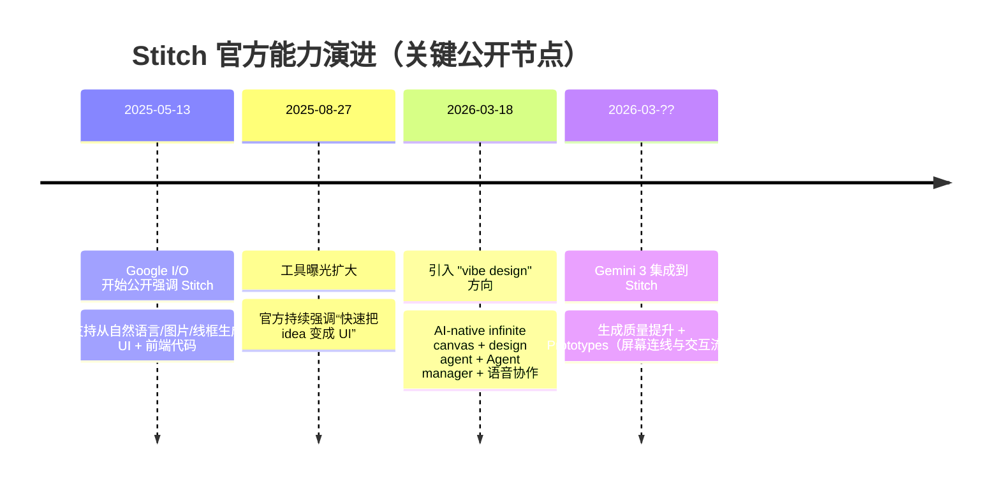
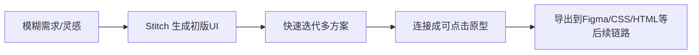
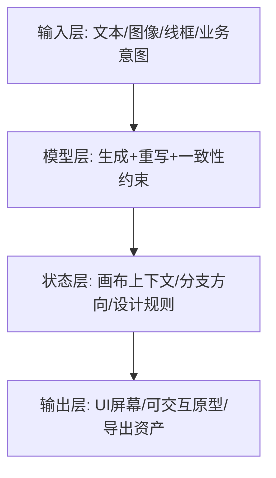
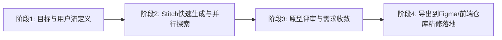

最近很多人在问：`stitch.withgoogle.com` 到底是什么，能不能真正进入团队工作流，而不是只做 demo？

这篇我只基于公开官方信息做整理，并把“宣传语”翻译成“工程语言”来判断它的真实价值。

## 一句话结论

Stitch 不是“替代 Figma 的完整设计平台”，更像是一个 **AI-native 的 UI 生成与快速原型层**：  
擅长把想法快速转成高保真界面与交互流，再导出到现有设计/开发链路继续深加工。

## 1. 时间线：Stitch 在 2025-2026 的演进

从这个节奏可以看出，Stitch 不是停在“文生图 UI”，而是在补全设计流程中的中间层能力：  
从“单屏生成”走向“多屏、可交互、可协作”。

## 2. 产品定位：它试图解决的不是“画图”，而是“启动成本”

传统 UI 流程里最贵的一步，往往是“从模糊想法到可讨论原型”的第一跳。  
Stitch 的价值点集中在这一跳：

1. 输入门槛低（自然语言、图片、线框、业务目标描述）。  
2. 输出颗粒度高（高保真 UI + 可继续迭代）。  
3. 反馈回路快（快速试错多方案，而不是单方案慢打磨）。

本质上，Stitch 在吃“0 到 1 的设计探索”，不是“1 到 N 的设计系统治理”。

## 3. 核心能力拆解（按工作流理解）

## 3.1 生成层：多模态输入到高保真 UI

官方公开信息反复强调三类输入：

- 自然语言描述  
- 图片/参考图  
- 线框（wireframe）

你不需要先有完整组件规范，也能把概念推到可讨论状态。

## 3.2 画布层：AI-native infinite canvas

2026-03-18 的更新里，Stitch 被明确描述为 AI-native 设计画布：

- 支持在画布中混合文本、图像、代码作为上下文；
- 支持发散与收敛（并行探索多个方向）；
- 不是单轮 prompt->单图，而是持续演化项目状态。

这意味着它开始从“生成器”向“创作环境”移动。

## 3.3 代理层：Design Agent + Agent Manager

官方表述里提到：

- 设计代理可理解项目演进上下文；
- Agent manager 用于管理并行方向与进度。

如果这套能力稳定，设计探索会从“单线程对话”变成“多分支搜索”，更接近工程分支模型。

## 3.4 原型层：Prototypes / Stitch 屏幕流

Gemini 3 更新中明确提到了 Prototypes：

- 在画布上把不同 screen 串起来；
- 可以直接演示交互与 user flow，而不只看静态稿。

这对 PM/研发评审很关键：讨论焦点从“UI漂不漂亮”变成“流程能不能跑通”。

## 3.5 协作层：语音“vibe design”

2026-03-18 更新里还强调了 voice 能力：

- 语音提出变更要求；
- 实时获得设计 critique；
- 对话式生成多个变体。

它更像“设计搭子”而不是“自动出图机”。

## 3.6 资产层：DESIGN.md 与设计规则迁移

一个值得注意的新点是 `DESIGN.md`：

- 用 agent-friendly 的 markdown 存设计规则；
- 目标是让规则可在项目间复用、可与其他设计/编码工具衔接。

这一步如果成熟，会把“风格一致性”从隐性经验转成可迁移文本资产。

## 4. Stitch 的技术本质（我的判断）

下面这部分是我的推断，不是官方原文：

Stitch 的系统可能由三层耦合构成：

难点不在“画一个好看界面”，而在：

1. 多轮迭代后的一致性保持；  
2. 多屏用户流的逻辑连续性；  
3. 导出后在下游工具继续可维护。

所以判断 Stitch 是否“能用”，要看它在长链路里的稳定性，不是首屏惊艳度。

## 5. 适用场景与不适用场景

## 5.1 适用

1. 需求探索期：快速出多个方向供讨论。  
2. 原型验证期：用可点击 flow 对齐业务流程。  
3. 跨职能沟通：PM/设计/研发快速共享一个“可看可点”的中间产物。  
4. 小团队 MVP：先要速度，再进精修链路。

## 5.2 不适用（至少当前不建议单独依赖）

1. 大规模设计系统治理（复杂 token / 组件规范强约束）。  
2. 高一致性品牌交付（大量手工细节与审美微调）。  
3. 无障碍/合规要求极高的正式交付（需要额外审计）。  
4. 已有成熟 Figma 组件体系的大团队全量替代。

一句话：  
**Stitch 强在“起步和试错”，弱在“最终精修与治理闭环”。**

## 6. 实战使用路径（推荐）

如果你要把 Stitch 真正接入流程，我建议用“4段式”：

## 阶段1：先写意图，不先写像素

输入里优先提供：

- 业务目标  
- 用户角色  
- 关键流程  
- 成功指标

而不是先纠结阴影和圆角。

## 阶段2：并行出 3-5 个方向

每个方向只解决一个核心问题（例如转化、导航、可读性），  
避免“一个大 prompt 想解决所有问题”。

## 阶段3：原型评审只看流程与决策点

评审时优先问：

1. 用户能否在 3 步内完成目标？  
2. 哪个页面是决策阻塞点？  
3. 哪个交互会导致歧义？

## 阶段4：导出后进入工程化精修

把导出内容当“半成品”：  
进入设计系统对齐、前端规范化、可访问性与性能优化流程。

## 7. 风险清单（提前避坑）

1. 过度依赖一次生成：没有分支对比就收敛，决策质量会下降。  
2. 只看视觉不看流程：原型看起来好，但任务路径断裂。  
3. 导出即上线：忽略了工程层的状态管理、可维护性、可测性。  
4. 无规则输入：团队成员各自 prompt 风格，最终资产不可复用。  

建议至少准备一份团队级输入模板和评审清单。

## 8. 你该不该用 Stitch？

给你一个简单判断框架：

| 问题 | 如果答案是“是” |
|---|---|
| 你们常卡在“需求到首版原型”这一步吗？ | Stitch 值得试 |
| 你们需要在一周内快速迭代多个设计方向吗？ | Stitch 值得试 |
| 你们已有成熟设计系统并且主要痛点是精修交付吗？ | Stitch 价值有限 |
| 你们希望一键替代现有设计/开发全流程吗？ | 预期应下调 |

我自己的结论：  
Stitch 现在最适合作为 **前置探索引擎**，而不是“终局交付平台”。

## 9. 参考来源（官方）

1. [Stitch from Google Labs gets updates with Gemini 3](https://blog.google/innovation-and-ai/models-and-research/google-labs/stitch-gemini-3/)  
2. [Introducing “vibe design” with Stitch（2026-03-18）](https://blog.google/innovation-and-ai/models-and-research/google-labs/stitch-ai-ui-design/)  
3. [Google AI developer updates at I/O 2025（含 Stitch 首发描述）](https://blog.google/innovation-and-ai/technology/developers-tools/google-ai-developer-updates-io-2025/)  
4. [5 things from Google I/O 2025 you can try right now（含 Stitch 使用场景）](https://blog.google/innovation-and-ai/products/io-2025-tools-to-try-globally/)  
5. [Stitch 官方入口](https://stitch.withgoogle.com/)

---

如果你愿意，我下一篇可以直接写“Stitch 实战提示词与评审模板”，给你一套可以复制到团队内部 wiki 的版本（输入模板 + 评审表 + 导出后工程验收清单）。
