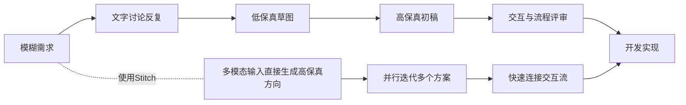
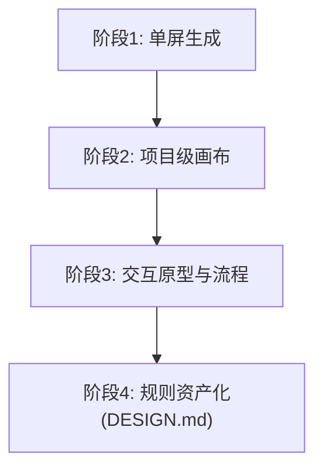
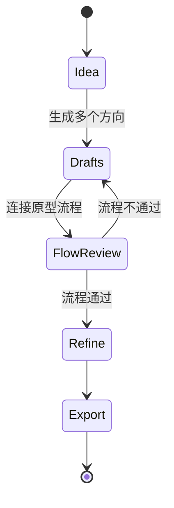
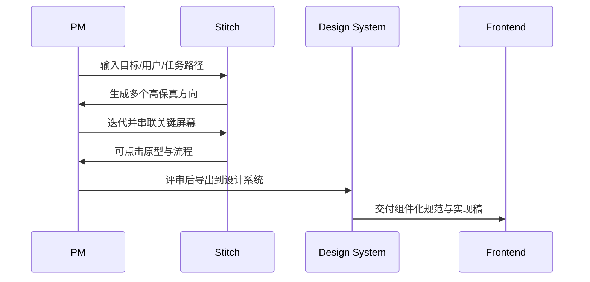
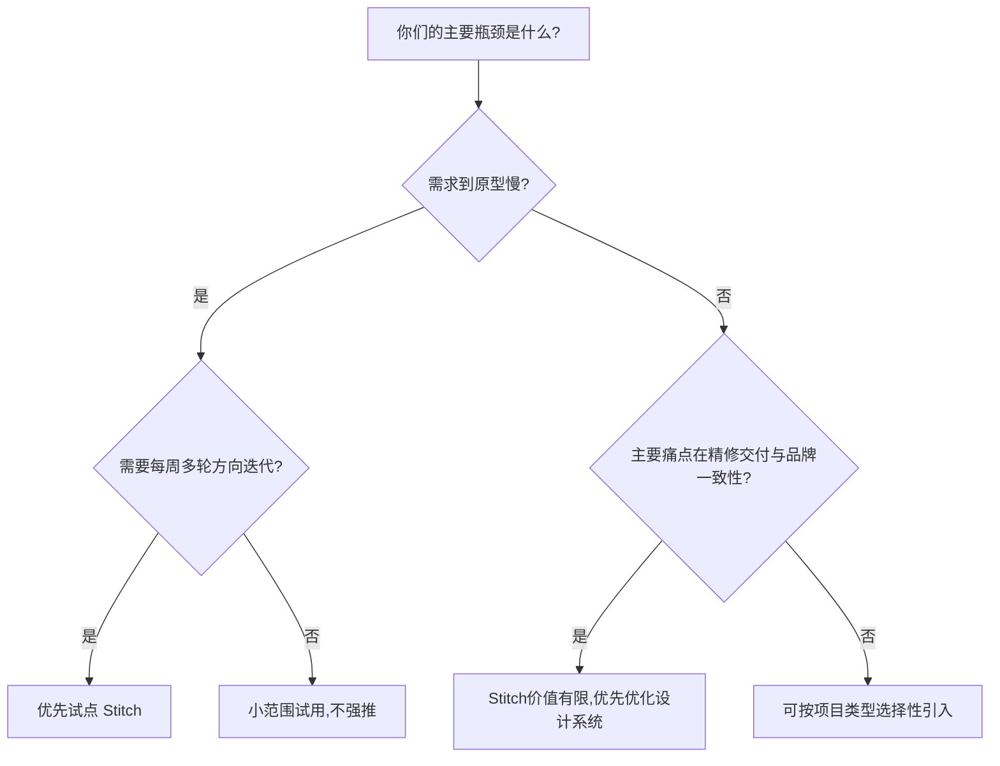
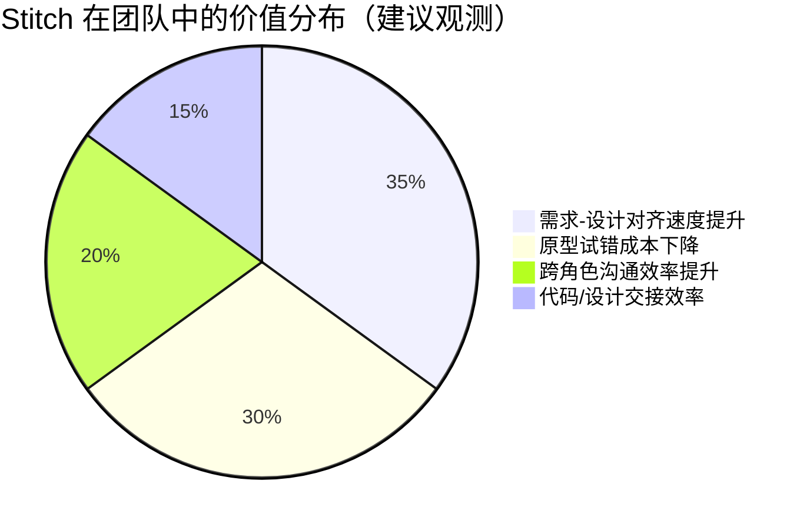

最近很多人在问：`stitch.withgoogle.com` 到底是什么，能不能真正进入团队工作流，而不是只做 demo？

我尽量用一种“真的能帮你做决策”的方式来写这篇：不只讲它有什么功能，而是讲它在真实团队里能解决什么、不能解决什么、应该放在流程哪里。

## 先说结论（给赶时间的人）

Stitch 目前最适合的定位是：  
**“需求探索阶段的 AI 设计引擎”**，不是“全流程设计系统平台”。

它最强的价值不是替代 Figma，而是把“模糊想法 -> 可讨论原型”这一步明显加速。  
如果你把它当成“起步引擎”，收益会非常明确；如果把它当“终局工具”，预期大概率会错位。

## 1. 为什么 Stitch 会被关注：它卡住的是最贵的那一步

产品团队最贵的环节，通常不是最终像素精修，而是前期反复：

1. 需求讲不清，设计没法开工。  
2. 设计初稿有了，但讨论不在一个频道。  
3. PM、设计、前端对“交互流程”理解不一致。  
4. 直到代码阶段才发现信息结构有问题。

Stitch 的价值在于把这条链路前推，让讨论尽早发生在“可视化原型”层，而不是“口头描述”层。

你可以把它理解为：  
Stitch 缩短的不是“像素打磨时间”，而是“团队对齐时间”。

## 2. 从官方节奏看产品走向：不是单点炫技，而是补链路

从 2025 I/O 到 2026 春季更新，Stitch 的叙事在变化：

1. 初期强调“文本/图像/线框 -> UI + 前端代码”。  
2. 后续强调“AI-native canvas + 设计代理 + 多方向管理”。  
3. 再往后强调“Prototypes（屏幕连线/交互预览）+ 语音协作 + DESIGN.md”。

这说明它不是只做一件事（生成一屏），而是在补齐“探索到原型”的中间层。

这个趋势对团队的意义是：  
Stitch 正在从“功能”变成“工作方式”。

## 3. 你到底在用什么：六层能力，不是一句“AI 画 UI”

很多人第一次用 Stitch 会误判：觉得它只是“文生图 UI”。  
其实从官方公开描述看，它至少有六层能力：

| 层 | 你看到的功能 | 真实作用 |
|---|---|---|
| 输入层 | 文本/图片/线框输入 | 降低起步门槛，快速给出方向 |
| 画布层 | AI-native infinite canvas | 支持项目级发散与收敛 |
| 代理层 | Design Agent / Agent manager | 管理多方向探索与上下文 |
| 原型层 | Prototypes / Play | 让讨论从静态图转到流程 |
| 协作层 | 语音“vibe design” | 加快评审与迭代反馈 |
| 资产层 | DESIGN.md | 把规则转成可迁移资产 |

如果你只把它当“生成器”，只会拿到 30% 的价值。  
真正高价值在“代理+原型+规则资产”三者联动。

## 4. 这类工具最容易被误用：我见过的三种错位

## 错位 1：把它当“最终视觉交付工具”

结果：早期效率很高，后期在品牌细节、复杂组件规则、跨页面一致性上遇到摩擦。  
修正：把它明确放在“探索和原型层”，后续转入成熟设计系统。

## 错位 2：只生成一个版本就收敛

结果：把“生成速度快”误用成“决策速度快”，质量反而下降。  
修正：强制并行生成 3-5 个方向，再基于指标筛选。

## 错位 3：只评审视觉，不评审流程

结果：界面看起来很对，任务路径却断裂。  
修正：评审时先看用户流、状态切换、边界路径，再看视觉。

这个状态机比“出图就过”要慢一点，但会极大降低返工。

## 5. 实战中怎么接：一条不会翻车的 4 段式路径

如果你直接“想到什么就让 AI 画”，最后很容易堆成一堆漂亮但不连贯的页面。  
更稳的做法是四段：

## 阶段 1：先定义“目标与路径”，再定义“风格”

建议先给 Stitch 的不是“颜色和按钮样式”，而是：

1. 用户是谁。  
2. 用户要完成什么任务。  
3. 成功路径和失败路径是什么。  
4. 你最担心哪个体验风险。

## 阶段 2：一次至少出 3 个方向

每个方向只优化一件事（比如转化、导航、密度），  
不要一个方向试图兼顾全部目标。

## 阶段 3：用原型做“流程评审”，不是“审美评审”

先问流程问题：

1. 用户能否在最短路径完成任务？  
2. 哪一步最容易产生误解？  
3. 错误状态怎么恢复？

## 阶段 4：导出后进入专业链路

导出不是终点，而是交接点。  
之后应该进入你现有的设计系统、前端规范和 QA 流程。

## 6. 决策框架：你的团队该不该现在上 Stitch？

可以直接用这张“是否采用”决策图：

一个简单原则：  
**如果你们卡在“前期探索”，Stitch 有价值；如果你们卡在“后期精修”，Stitch 不是首要解法。**

## 7. 价值账本：它到底带来什么，成本是什么

为了避免“用了觉得很酷，但说不清值不值”，建议把价值和成本写成账本。

对应成本通常是：

1. 学习与流程改造成本（要改评审方法）。  
2. 规则治理成本（需要输入模板和评审标准）。  
3. 导出质量清洗成本（不能直接上线）。

如果你不愿意付这三类成本，Stitch 很容易沦为“好看的实验工具”。

## 8. 一套可直接复制的团队模板（建议）

### 8.1 输入模板（给 Stitch）

1. 业务目标：这次要优化什么指标。  
2. 用户画像：核心用户和场景。  
3. 关键任务：用户要完成哪 1-2 件事。  
4. 约束条件：品牌、平台、可访问性要求。  
5. 风险假设：最担心哪里失败。

### 8.2 评审模板（内部评审）

1. 流程是否闭环（成功/失败/恢复路径）。  
2. 信息架构是否清晰（用户是否迷路）。  
3. 关键行为是否可达（核心按钮/状态可发现）。  
4. 视觉层是否服务任务（不是仅仅好看）。

### 8.3 交接模板（导出后）

1. 页面列表与流程图。  
2. 状态清单（空态、加载态、错误态）。  
3. 组件映射（与现有设计系统的对应关系）。  
4. 开发实现优先级（先做路径，再做细节）。

## 9. 我的最终判断（更实话版）

如果你问我“Stitch 值不值得用”，我的答案是：

- 值得，但要放在对的位置；  
- 值得，但要配流程，不是只配 prompt；  
- 值得，但不要把它当成万能替代。

它最好的使用姿势是：  
**成为你团队“探索层”的默认引擎，然后把成熟结果送回既有设计与工程系统。**

这才是它在真实项目里最可持续的价值。

## 9. 参考来源（官方）

1. [Stitch from Google Labs gets updates with Gemini 3](https://blog.google/innovation-and-ai/models-and-research/google-labs/stitch-gemini-3/)  
2. [Introducing “vibe design” with Stitch（2026-03-18）](https://blog.google/innovation-and-ai/models-and-research/google-labs/stitch-ai-ui-design/)  
3. [Google AI developer updates at I/O 2025（含 Stitch 首发描述）](https://blog.google/innovation-and-ai/technology/developers-tools/google-ai-developer-updates-io-2025/)  
4. [5 things from Google I/O 2025 you can try right now（含 Stitch 使用场景）](https://blog.google/innovation-and-ai/products/io-2025-tools-to-try-globally/)  
5. [Stitch 官方入口](https://stitch.withgoogle.com/)

---

如果你愿意，我下一篇可以继续写成“Stitch 落地包”版本：  
包含 20 条可直接复制的提示词、团队评审表、以及“导出到前端后的验收 checklist”。
