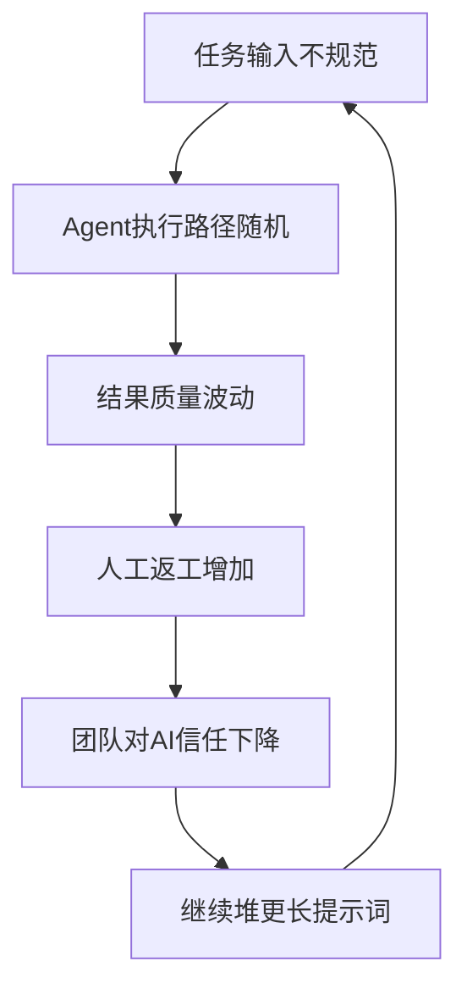
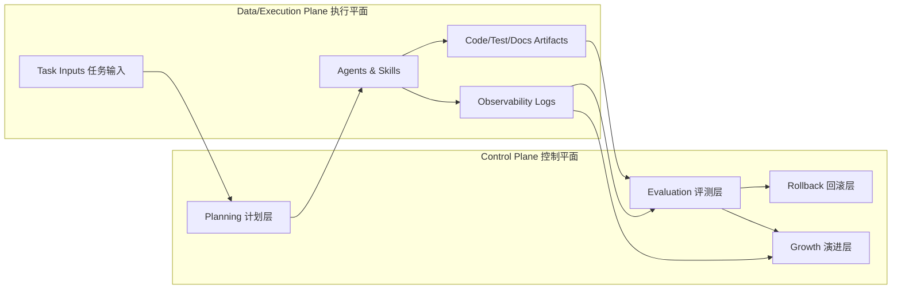
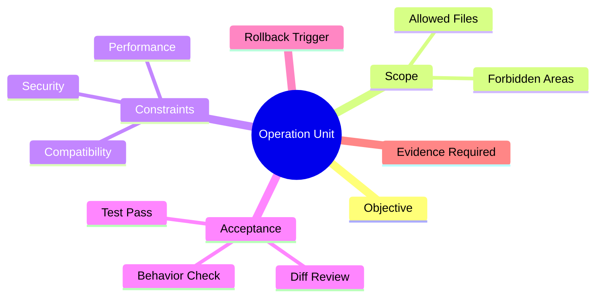
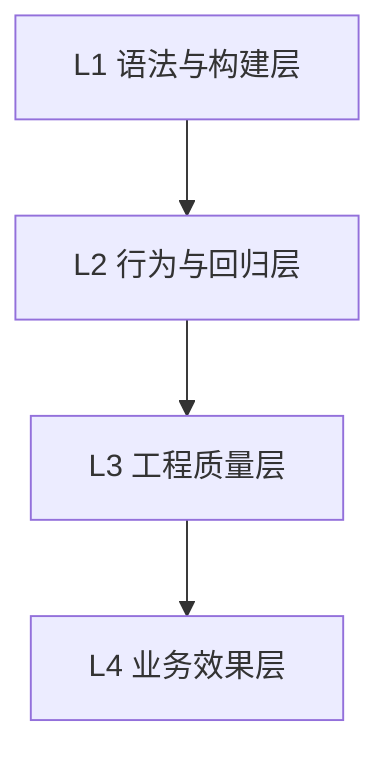
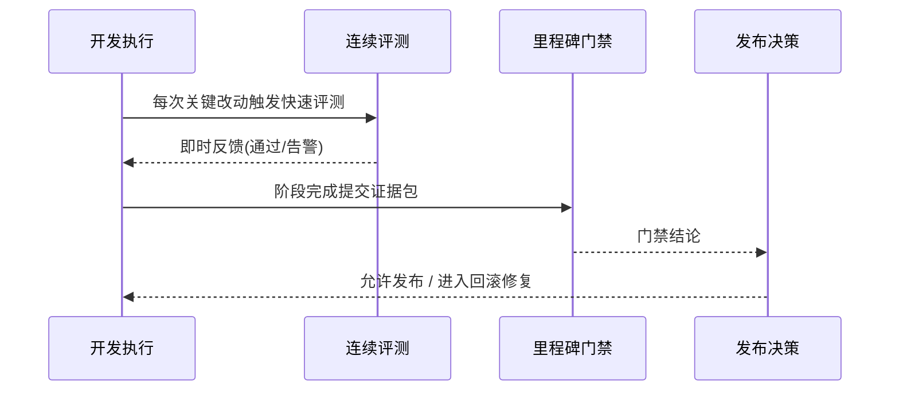
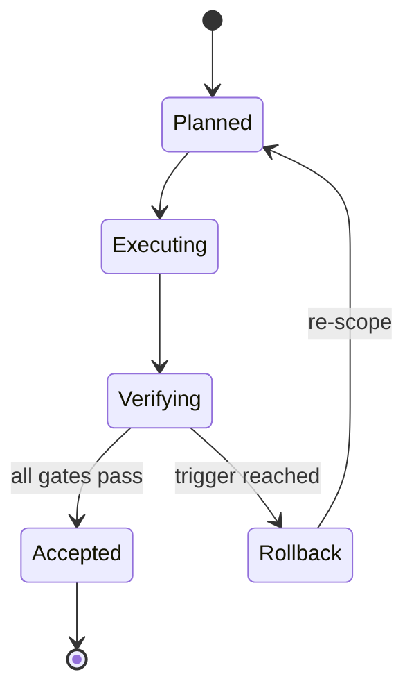
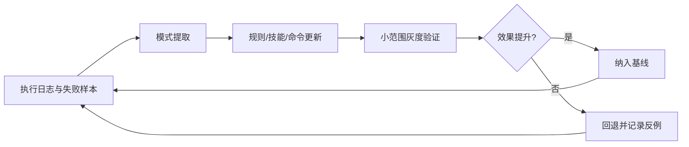
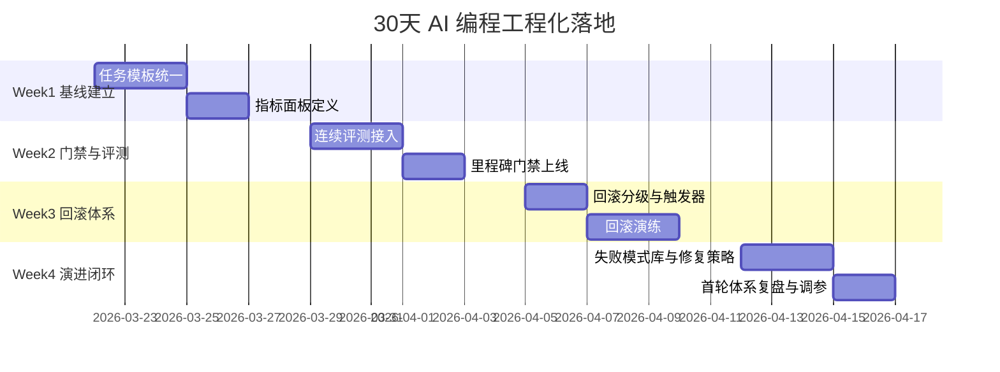

很多团队都经历过同一条曲线。

第一阶段，大家被 AI 编程的速度震撼，觉得“会写提示词就够了”。  
第二阶段，问题开始集中爆发：产出不稳定、质量不可控、上下文失忆、返工率飙升。  
第三阶段，团队内部出现分裂：有人继续堆 prompt，有人开始怀疑 AI 编程是伪命题。

这条曲线的根因不是“模型不行”，而是你把一个系统工程问题，当成了一个输入技巧问题。

如果一句话概括本文：  
**AI 编程不是 Prompt Engineering 问题，而是 Harness Engineering 问题。**

你真正要建设的，不是“一组神提示词”，而是一个可以稳定产出的工程系统。  
这个系统至少要具备四个能力：

1. 可计划：知道要做什么、为什么做、做到什么算完成。  
2. 可评测：知道做得好不好，问题在哪，是否值得进入下一阶段。  
3. 可回滚：知道出错后如何安全撤退，不把局面越修越乱。  
4. 可演进：知道如何持续改进，不靠“下次注意”。

下面我把这四个能力拆成可执行框架，并给出一套可以直接用在团队里的模板。

## 一、先把“玄学模式”讲清楚：为什么它一定会崩

所谓“提示词玄学”，不是指 prompt 不重要，而是指团队把系统成功寄托在 prompt 上。  
它通常表现为六个特征：

1. 任务入口不标准：每个人都用自己的问法。  
2. 目标定义不清晰：完成标准模糊，靠“看起来不错”。  
3. 过程不可观测：中间决策和失败原因无记录。  
4. 质量无闭环：只有“跑通了”指标，没有“可维护性”指标。  
5. 失败无代价边界：改坏了再说，靠经验救火。  
6. 改进无机制：复盘停留在观点，不形成流程资产。



上图是一个典型劣化回路。  
它最危险的点不在于偶发失败，而在于“失败会自我强化”。

## 二、工程化总架构：四能力系统不是口号，而是控制平面

把 AI 编程工程化，建议用“控制平面 + 执行平面”视角理解。



这张图背后的核心思想是：  
**不要把“执行”直接暴露给“人脑判断”，中间必须经过“可验证的控制层”。**

换句话说，工程化不是“限制 AI”，而是“给 AI 执行增加可治理边界”。

## 三、可计划：把“我要做功能”变成“可执行作战单元”

很多团队把计划理解为“列 TODO”，这是不够的。  
在 AI 编程场景，计划要承担两个额外职责：

1. 给 Agent 提供最小充分上下文。  
2. 给人类提供明确验收与风险边界。

### 3.1 计划对象要从“任务”升级为“作战单元”

一个合格的作战单元至少包含：

- `Objective`：这次要改变什么结果。  
- `Scope`：允许改哪些文件，不允许碰哪些区域。  
- `Constraints`：性能/安全/兼容/风格等硬约束。  
- `Acceptance`：通过标准（测试、行为、指标）。  
- `Rollback Trigger`：触发撤退的阈值条件。  
- `Evidence Required`：交付时必须附的证据类型。



### 3.2 计划分层：战略计划、战役计划、战术计划

团队经常失败在“所有任务同一粒度”。  
正确做法是三层分离：

| 层级 | 周期 | 产物 | 关注点 |
|---|---|---|---|
| 战略计划 | 月/季度 | 路线图、能力建设目标 | 做对方向 |
| 战役计划 | 周 | 迭代目标、风险登记 | 做对优先级 |
| 战术计划 | 日/任务级 | 作战单元、验收脚本 | 做对执行 |

如果你只做战术而没有战役，团队会变成高频忙碌。  
如果你只有战略没有战术，团队会变成空转焦虑。

### 3.3 计划质量门槛（Planning Gate）

进入执行前，至少做这 7 项检查：

1. 目标是否可测量（不是“优化一下”）。  
2. 范围是否可边界化（明确允许/禁止文件）。  
3. 约束是否可验证（性能阈值、兼容矩阵）。  
4. 验收是否可自动化（测试脚本或检查命令）。  
5. 风险是否可预判（列出前三风险）。  
6. 回滚条件是否明确（触发阈值可执行）。  
7. 证据是否可生成（日志、diff、测试报告）。

只要有两项答不上来，不进入执行。

## 四、可评测：从“感觉不错”变成“指标驱动决策”

没有评测系统，AI 编程只会进入“偶然成功叙事”。  
可评测不等于“只跑测试”，而是要构建多维质量面板。

### 4.1 四层评测模型



- L1 语法与构建层：lint、typecheck、build。  
- L2 行为与回归层：单测、集成、e2e、关键路径回归。  
- L3 工程质量层：复杂度、重复率、可读性、变更集中度。  
- L4 业务效果层：缺陷率、交付周期、返工率、线上稳定性。

绝大多数团队只做到 L1/L2，因此“代码能跑但系统在退化”。

### 4.2 三类核心指标：质量、效率、稳定性

| 类别 | 指标 | 建议阈值 | 解释 |
|---|---|---|---|
| 质量 | 关键用例通过率 | >= 98% | 不追求全测 100%，先保关键路径 |
| 质量 | 回归缺陷引入率 | <= 3% | 每次变更引入回归的比例 |
| 效率 | Lead Time（需求到上线） | 周环比下降 | 看系统效率，不看单次峰值 |
| 效率 | 人工返工占比 | <= 20% | 返工越高，说明 Agent 稳定性差 |
| 稳定性 | 回滚频次 | <= 5% | 频繁回滚说明策略过激 |
| 稳定性 | 变更失败率 | <= 10% | DevOps 经典稳定性指标 |

### 4.3 pass@k 与 pass^k 的工程意义

很多人会提 `pass@k`，但常忽略 `pass^k`。

- `pass@k`：k 次尝试至少一次成功，衡量“可解性”。  
- `pass^k`：k 次尝试全部成功，衡量“一致性与稳健性”。

在工程场景：

1. 探索期用 `pass@k`，判断有没有解。  
2. 生产期看 `pass^k`，判断能否稳定交付。

如果你的系统只在 `pass@k` 上好看，而 `pass^k` 很差，  
那说明你在“撞大运式成功”，而不是工程能力。

### 4.4 评测时序：不要一次性做“总审判”

正确时序是“连续小评测 + 里程碑大评测”。



连续评测降低延迟，里程碑门禁控制风险。  
两者缺一不可。

## 五、可回滚：没有撤退能力，就没有进攻资格

AI 编程最常见的管理误区是：  
“先让它改，出问题再人工救。”

这在小项目偶尔可行，在团队规模下几乎必崩。  
因为当系统复杂度上去后，回滚成本会指数增长。

### 5.1 回滚分级模型

| 级别 | 场景 | 处理方式 | 目标 |
|---|---|---|---|
| L1 任务内回滚 | 单任务改坏 | 丢弃本次变更，回到任务起点 | 秒级止损 |
| L2 分支回滚 | 多任务串扰 | 回滚分支到稳定提交 | 分钟级恢复 |
| L3 发布回滚 | 线上异常 | 切回上一个稳定版本 | 小时级恢复 |
| L4 策略回滚 | 方法失效 | 撤回流程策略，恢复上一治理版本 | 日级校准 |

回滚不是 Git 命令本身，而是“预先设计的恢复路径”。

### 5.2 回滚触发条件必须前置

在任务开始前就写明触发器，例如：

1. 关键测试失败且 2 次修复无效。  
2. 性能回退超过 15%。  
3. 安全扫描出现高危。  
4. 变更范围越界（触碰禁止目录）。  
5. 评测证据缺失（无法验收）。



这张状态机很关键。  
它把“失败”从羞耻事件变成系统内正常分支。

### 5.3 回滚工件：必须与交付工件同等重要

建议每次任务交付同时提交“回滚包”：

- `Rollback Plan`：执行步骤与负责人。  
- `Safe Commit`：可快速切回的稳定点。  
- `Data Migration Guard`：数据变更保护与逆向脚本。  
- `Blast Radius`：影响范围说明。  
- `Verification after rollback`：回滚后校验清单。

没有回滚包，默认不允许进入发布。

## 六、可演进：把每次失败变成系统资产

“可演进”是最容易被忽略、但长期收益最高的能力。  
很多团队复盘做得很认真，但没有“机制化沉淀”，于是同样问题反复出现。

### 6.1 演进闭环模型



关键是“反例也入库”。  
如果你只保存成功经验，不保存失败路径，系统会持续高估自己。

### 6.2 演进对象不只 prompt

可演进对象至少有五类：

1. 任务模板（Planning 模板）。  
2. 质量门槛（评测阈值）。  
3. 回滚策略（触发器与流程）。  
4. 技能资产（skills/rules/commands）。  
5. 组织协作（角色分工与 handoff 协议）。

这意味着演进是“系统演进”，不是“提示词打磨”。

### 6.3 反脆弱机制：把失败当作训练集

建议把失败按三类标签归档：

- `Type A`：执行错误（改错文件、漏约束）。  
- `Type B`：评测缺陷（门禁没挡住问题）。  
- `Type C`：计划缺陷（目标定义本身不对）。

每周统计 Top3 失败模式，并规定每个模式只能对应一个系统修复动作。  
避免复盘变成“观点大会”。

## 七、一个完整的落地蓝图：30 天把团队拉出玄学区

很多方法论失败，不是因为错，而是太重。  
下面给一个可以在真实团队跑起来的 30 天最小蓝图。



### 7.1 Week1：建立统一任务契约

目标不是追求快，而是追求同一口径。  
所有任务必须用统一模板提交，禁止自由发挥。

### 7.2 Week2：建立“双评测机制”

接入连续评测（快速反馈）与里程碑门禁（发布控制）。  
这一步会让交付速度看起来短期变慢，但返工率会快速下降。

### 7.3 Week3：先学会撤退，再扩大授权

必须做至少一次回滚演练。  
没有演练过的回滚方案等于没有方案。

### 7.4 Week4：把失败变资产

建立失败模式库与修复动作库。  
如果这一步不做，前三周成果会在两个月内衰减。

## 八、管理层最关心的问题：这套体系值不值得

你可以用一个简化 ROI 框架判断：

| 维度 | 玄学模式 | 工程模式 |
|---|---|---|
| 交付速度 | 初期快，后期波动大 | 初期略慢，后期稳定快 |
| 返工成本 | 高且不可预测 | 可控且逐步下降 |
| 人员依赖 | 强依赖个体高手 | 依赖流程资产 |
| 风险控制 | 事故后处理 | 事故前防控 |
| 组织学习 | 经验口口相传 | 经验系统沉淀 |

如果你的团队已经出现以下任一症状，就说明该转了：

1. 同类问题重复出现超过三次。  
2. 关键交付越来越依赖少数人“救火”。  
3. AI 产出可跑但不可维护。  
4. 每次出问题都要“开会定性”而不是“流程定责”。

## 九、常见误区：工程化不是加流程，而是降随机性

### 误区 1：工程化会扼杀创造力

事实是，工程化扼杀的是随机返工，不是创造力。  
创造力应该用在“问题建模与策略设计”，不是用在“重复踩坑”。

### 误区 2：我们团队小，不需要这套

团队越小，越怕系统性失误。  
因为没有冗余人力给你兜底。

### 误区 3：先跑起来再说，后面再补治理

后补治理通常成本更高。  
系统习惯一旦形成，迁移代价远大于前置约束。

### 误区 4：指标会导致形式主义

错误不在指标，而在指标设计。  
指标应该服务决策，不是服务汇报。

## 十、给你一套可直接复制的“任务执行卡片”

你可以把下面这段当作团队默认模板使用。

```text
[Operation Unit]
Objective:
Scope:
Constraints:
Acceptance:
Rollback Trigger:
Evidence Required:

[Execution]
Planned Changes:
Actual Changes:
Out-of-Scope Findings:

[Evaluation]
L1 Build/Lint:
L2 Tests:
L3 Code Quality:
L4 Business Proxy:

[Decision]
Ship / Fix / Rollback:
Owner:
Timestamp:
```

模板的价值不在格式，而在它强制你回答最关键的治理问题。

## 结语：把 AI 编程从“高手手艺”变成“组织能力”

如果你只想要短期速度，提示词玄学就够了。  
如果你要的是长期稳定交付，就必须工程化。

工程化的本质不是“多文档、多流程”，而是三件事：

1. 把目标变成可执行契约。  
2. 把质量变成可观测数据。  
3. 把失败变成可复用资产。

当你做到这三件事，  
AI 编程就不再依赖“谁今天状态好”，而是进入“系统可控增长”。

这才是“可计划、可评测、可回滚、可演进”的真正含义。
